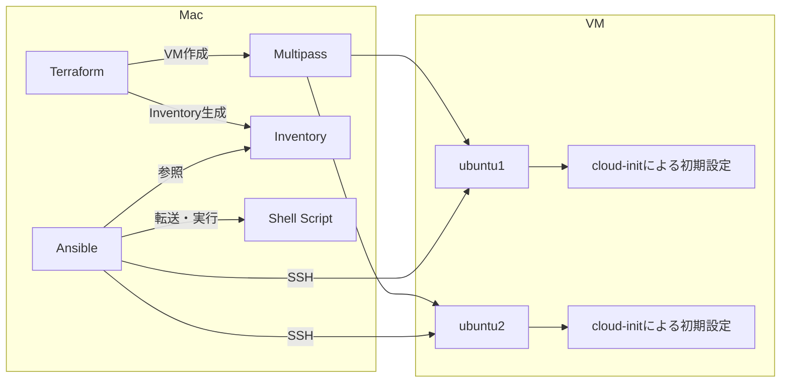

# Ansible勉強会 — Terraform + Multipass + Ansible ワークショップ

Mac上に構築したUbuntu VM（[Multipass](https://canonical.com/multipass/install)）に対して、[Terraform](https://developer.hashicorp.com/terraform/install)でインフラを構築し、[Ansible](https://docs.ansible.com/projects/ansible/latest/installation_guide/intro_installation.html#installing-and-upgrading-ansible-with-pipx)でリモート操作を行う流れを、実際に手を動かしながら学ぶための社内勉強会用リポジトリです。

Terraform・Ansibleに初めて触れる人が、VM構築からAnsibleによるリモート実行（Mac上のShellスクリプトをVMへ転送して実行するところ）までを一通り体験できるように構成されています。

## 全体構成

Mac上でTerraformがMultipass VMを2台作成し、cloud-initが各VMの初期設定（ユーザー作成・SSH設定・Pythonインストールなど）を行います。Terraformはあわせて Ansible用のInventoryファイルも生成します。AnsibleはそのInventoryを参照してVMへSSH接続し、Playbookに従ってMac上のShellスクリプトをVMへ転送・実行します。



より詳しい最終形の図と解説は [documents/workshop_materials/005_terraform_ansible_workshop.md](documents/workshop_materials/005_terraform_ansible_workshop.md) を参照してください。

## ディレクトリ構成

```text
.
├── ansible/                    # Ansible Playbook・Inventory・スクリプト類
│   ├── inventory.ini           # 接続先定義（terraform apply時に自動生成）
│   ├── run_script.yml          # script moduleでMac上のShellをVMへ転送・実行するPlaybook
│   ├── run_template.yml        # template moduleでVMごとに変数を出し分けるPlaybookのサンプル
│   ├── scripts/                # MacからVMへ転送して実行するShellスクリプト
│   └── templates/              # VMへ配置するテンプレートファイル
├── terraform/                  # Multipass VMを作成するTerraform設定
│   ├── main.tf                 # VM作成・Inventory生成のリソース定義
│   ├── variables.tf            # 変数定義
│   ├── terraform.tfvars.example  # tfvarsのひな形
│   └── inventory.ini.tpl       # Ansible inventory生成用テンプレート
└── documents/
    └── workshop_materials/     # 本ワークショップのテキスト（後述）
```

各ファイルの詳細な役割は [documents/workshop_materials/003_terraform_ansible_workshop.md](documents/workshop_materials/003_terraform_ansible_workshop.md) の「6.1 ディレクトリ構成」にまとめられています。

## このワークショップの進め方

`documents/workshop_materials/` 以下のテキストを、以下の順番で読み進めてください。各ファイルの中でさらに章立てされているので、上から順に進めればそのまま学習の流れになります。

1. [001. はじめに / 論理構成 / Terraform・cloud-init・Ansibleの役割分担](documents/workshop_materials/001_terraform_ansible_workshop.md) — 勉強会の目的、全体構成、3つのツールがなぜ役割分担されているのかを理解する
2. [002. 事前準備 / Multipass概要](documents/workshop_materials/002_terraform_ansible_workshop.md) — Multipass・Terraform・Ansibleのインストールと、Ansible用SSH鍵の準備、Multipassの基本操作
3. [003. VM構築 / Terraform解説 / cloud-init概要](documents/workshop_materials/003_terraform_ansible_workshop.md) — ディレクトリ構成、`main.tf`などTerraformファイルの解説、cloud-initによる初期設定、VM構築の実行とトラブルシューティング
4. [004. Ansible実行 / Inventory解説 / Playbook解説](documents/workshop_materials/004_terraform_ansible_workshop.md) — Inventory・Playbookの構造、Ansibleでの接続確認、`script`/`template` moduleによるMacからVMへのリモート実行、演習問題
5. [005. 最終的な完成形 / まとめ](documents/workshop_materials/005_terraform_ansible_workshop.md) — 全体構成の総まとめと、自動化検証の基本パターン

### 前提となるソフトウェア

事前準備の詳細は[002章](documents/workshop_materials/002_terraform_ansible_workshop.md)にまとまっていますが、Mac上に以下をインストールする必要があります。

- [Multipass](https://canonical.com/multipass/install)（Ubuntu VMをMac上で動作させる）
- [Terraform](https://developer.hashicorp.com/terraform/install)（VM作成などのインフラ構築をコード化する）
- [Ansible](https://docs.ansible.com/projects/ansible/latest/installation_guide/intro_installation.html#installing-and-upgrading-ansible-with-pipx)（VMへの設定・処理を自動化する）

また、AnsibleがSSHでVMへ接続するための鍵（`~/.ssh/ansible/id_ed25519`など）を事前に用意します。手順は[002章「4.2 SSH鍵の準備」](documents/workshop_materials/002_terraform_ansible_workshop.md)を参照してください。

## 補足資料

`documents/` 配下には、上記の学習テキストのほかに、実装上の設計判断を記録した内部向けドキュメント（例: [cloud-init-ssh-key-yaml-safety-design.md](documents/cloud-init-ssh-key-yaml-safety-design.md)）も含まれています。ワークショップの学習コンテンツ本体ではないため、興味があれば参考程度にご覧ください。
