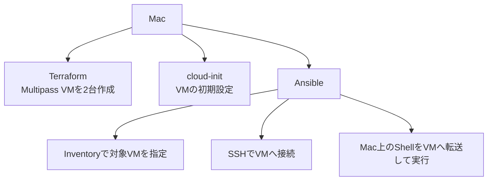
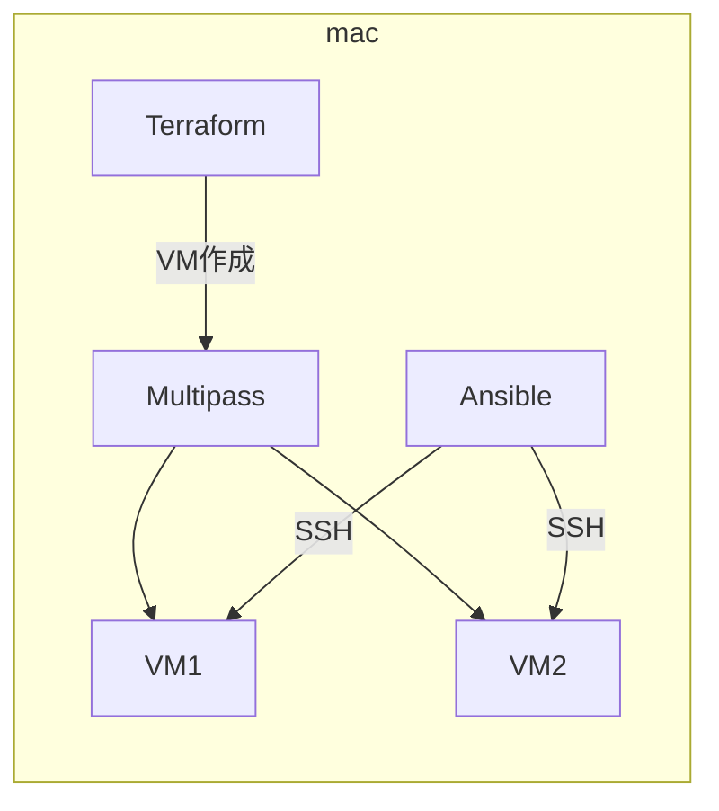
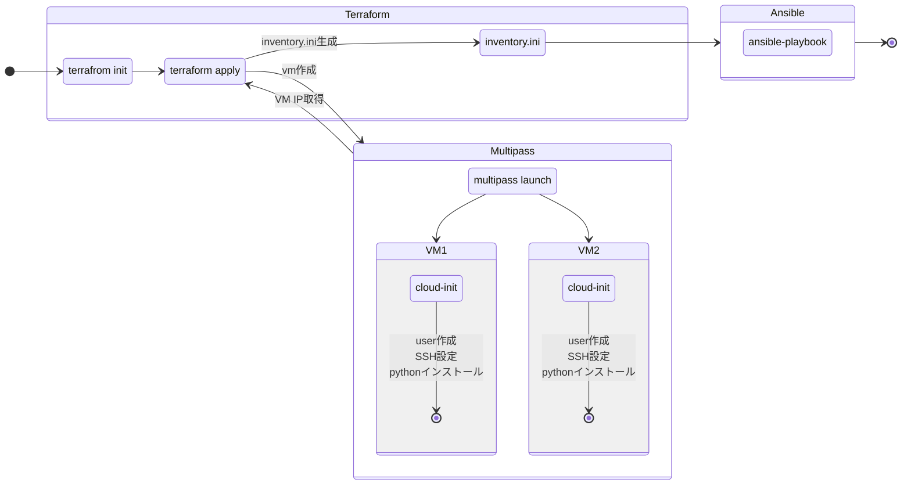
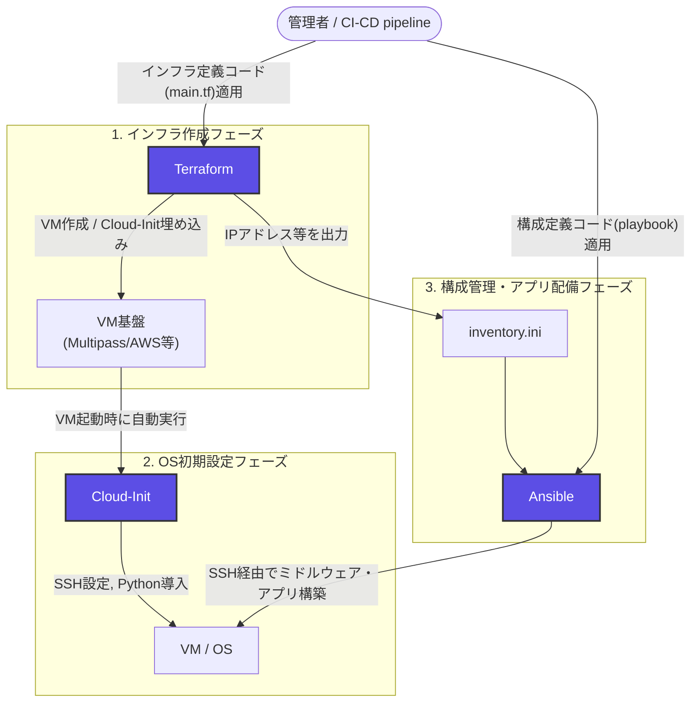

# Ansible勉強会

## Terraformで構築したMultipass VMへAnsibleでMacのShellをリモート実行する

---

## 目次

- **001：勉強会の概要・全体構成・ツールの役割分担**（本ページ）
- [002：事前準備とMultipassの基本操作](002_terraform_ansible_workshop.md)
- [003：TerraformによるVM構築とトラブルシューティング](003_terraform_ansible_workshop.md)
- [004：Ansibleの実行・Playbook解説・演習問題](004_terraform_ansible_workshop.md)
- [005：全体まとめと自動化検証の基本パターン](005_terraform_ansible_workshop.md)

---

# 1. はじめに

## 1.1 この勉強会の目的

この勉強会では、Mac上に2台のUbuntu VMを構築し、Ansibleからリモート操作するまでの一連の流れを学習する。

VMの作成にはTerraform、VMの初期設定にはcloud-init、VMに対する構築・設定・処理にはAnsibleを使用する。

最終的には、Mac上にあるShellスクリプトをAnsibleからVMへ転送し、リモートで実行する。

## 1.2 この勉強会で理解すること

この勉強会では、次の内容を理解することを目標とする。

- Multipassとは何か
- Terraform・cloud-init・Ansibleの役割分担
- Terraform main.tfとは何か
- cloud-initとは何か
- Ansible Inventoryとは何か
- Ansible Playbookとは何か
- Ansibleからリモートサーバーを操作する方法
- Mac上のShellスクリプトをAnsibleから実行する方法
- Multipassで問題が発生した場合の確認方法

## 1.3 用語一覧

本編に入る前に、これから登場する主要な用語を先にまとめておく。詳しい説明は各用語が初めて登場する章で行うため、ここでは「大まかにどういうものか」を掴めれば十分である。

| 用語 | この勉強会での意味 |
| --- | --- |
| VM | Mac上で動かすUbuntuの仮想マシン |
| Terraform | インフラをコードで管理するツール |
| Ansible | VMの設定・操作を自動化するツール |
| Inventory | Ansibleの操作対象一覧 |
| Playbook | Ansibleの処理手順 |
| Module | Ansibleが実際に処理を行う機能 |

より細かい用語（Provider、Controller、Managed Nodeなど）は、それぞれTerraform章（7章）・Ansible章（11章）で改めて紹介する。

---

# 2. 論理構成

## 2.1 全体構成

## 2.2 全体の流れ

## 2.3 使用するツール

| ツール | 役割 |
| --- | --- |
| Terraform | VM作成などのインフラ構築をコード化する |
| cloud-init | VM作成時の初期設定を行う |
| Ansible | VMへの設定・処理を自動化する |
| Multipass | Ubuntu VMをMac上で動作させる |

---

# 3. Terraform・cloud-init・Ansibleの役割分担

## 3.1 3つのツールの関係

| ツール | 役割・分類 | 担当レイヤー | 主な実行タイミング | 主な作業内容 |
| :--- | :--- | :--- | :--- | :--- |
| **Terraform** | インフラプロビジョニング | 外枠（クラウド / 物理インフラ） | API経由で事前実行 | VM作成、ネットワーク構築、`cloud-init` 設定（`user_data`）の注入 |
| **cloud-init** | OSブートストラップ（初期化） | OS土台（初回起動処理） | VMの初回ブート時 | ユーザー・SSH鍵設定、ネットワーク構成、Python導入など最小限の環境整備 |
| **Ansible** | 構成管理・自動化 | 中身（OS内部 / ミドルウェア） | OS起動・初期化完了後 | ミドルウェア（Nginx, Docker等）の導入、設定ファイル配布、アプリ構築 |

## 3.2 Terraform単体でも可能な作業をあえて役割分担すべき理由

Terraformは `remote-exec` プロビジョナーや `user_data` を使用することで、OS内部の設定まで完結させることも可能である。ただし、**「Terraform = 外枠」「cloud-init / Ansible = 中身」**のように役割を分離する構成は、今回のような検証環境やOS内部の変更が継続的に発生するケースにおいて理解しやすい設計パターンの一つである。

### 宣言型と手続型の違いによるメンテナンス性
* **Terraformの限界:** インフラ全体の「あるべき姿（宣言型）」の管理には適しているが、OS内部で一連のコマンドを順番に実行するような「手順（手続型）」の処理を管理する設計にはなっていない。
* **Ansibleの強み:** ベストプラクティスに基づいたモジュール（`apt`、`service`、`template`など）が豊富であり、OS内部の設定変更やサービス起動処理を安全かつ簡潔に記述できる。

### 状態管理（tfstate）の肥大化とリスクの回避
* **Terraformの仕組み:** すべてのコンポーネントの状態（tfstate）を追跡する仕組みを持つ。アプリの設定やミドルウェアの変更までTerraformで管理すると、`terraform plan` や `apply` の実行時間が極端に長くなる。
* **リスク分散:** インフラ層とOS/アプリ層を切り離すことで、OS内部の軽微な設定変更のたびにTerraformを実行し、基盤全体へ影響を与えるリスク（誤ってVMを再作成してしまう等）を回避できる。

### 実行時の冪等性（Idempotency）と安全性の確保
* **プロビジョナーの脆弱性:** Terraformの `remote-exec` 等は「コマンドの実行」を行うのみであり、失敗時のリカバリや「設定済みの場合のスキップ」といった高度な冪等性の確保が困難である。
* **Ansibleの強み:** 何度実行しても同じ正しい状態に収束するように設計されており、エラー発生時のハンドリングやドライラン（`--check`）も安全に行うことができる。

### 再利用性と責務の分離（チーム運用）
* **責務の明確化:** 「インフラチーム（クラウド基盤管理）」と「App/SREチーム（OS・ミドルウェア管理）」でコードベースや作業権限を分離できる。
* **再利用性:** AnsibleのプレイブックやRoleを共通化しておけば、クラウド環境（AWS, GCP, オンプレミス）が変更された場合でも、Terraform側のみを差し替えることで同一のOS設定を再利用できる。

## 3.3 まとめ（選定指針）

| 方式 | 特徴・適した用途 |
| :--- | :--- |
| **Terraform単体** | 検証環境や、Golden Image（AMI等）を作成するのみの単純な構成 |
| **Terraform + cloud-init** | コンテナホスト等、OS起動時に最小限の初期化（Docker導入等）で完結する場合 |
| **Terraform + Ansible (+ cloud-init)** | 複雑なミドルウェア構成、既存OS設定の継続的変更が必要な本番環境 |

---

[目次](001_terraform_ansible_workshop.md#目次) | [次へ：002：事前準備とMultipassの基本操作 →](002_terraform_ansible_workshop.md)
