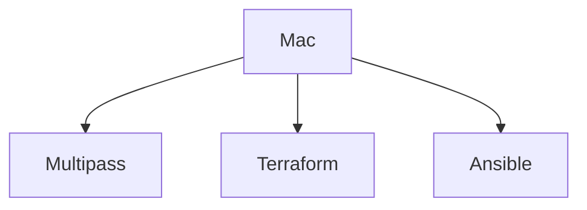
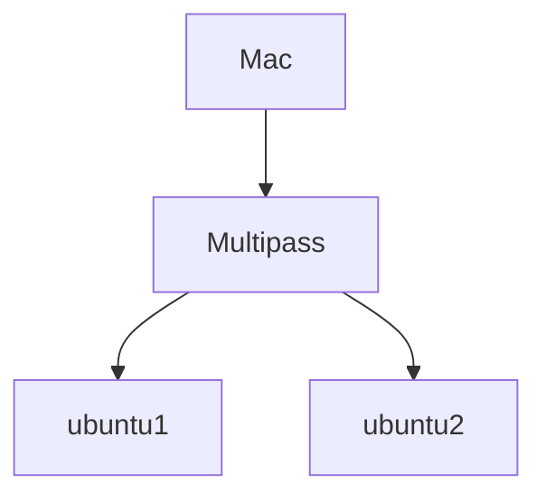
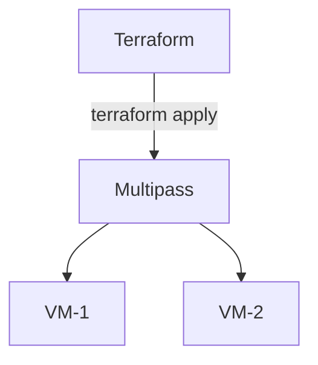
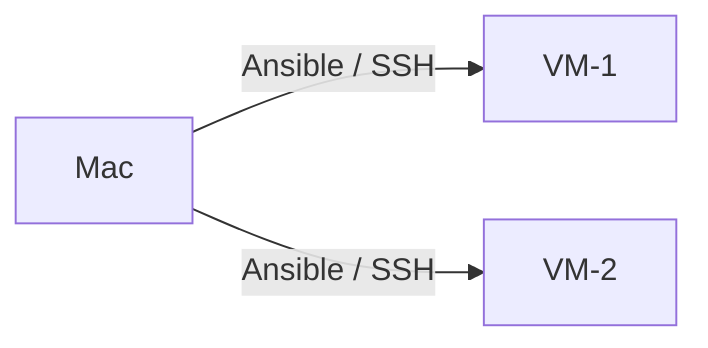
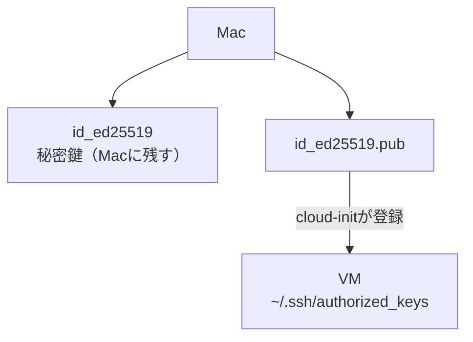

# 4. 事前準備

## 4.1 必要なソフトウェア

Macに以下のソフトウェアをインストールする。



### 4.1.1 Multipass

#### Multipassとは

Multipassは、Ubuntu VMを簡単に作成・管理するためのツールである。



#### インストール

[Install Multipass](https://canonical.com/multipass/install)

インストール後、以下のコマンドでバージョンが表示されることを確認する。

```bash
multipass version
```

基本的な操作コマンドは「5. Multipass概要」で解説する。

### 4.1.2 Terraform

#### Terraformとは

Terraformは、インフラストラクチャをコードで管理するためのツールである。

例えば、

```text
「Ubuntu VMを2台作成する」
```

という作業をTerraformの設定ファイルとして記述できる。



#### インストール

[Install Terraform](https://developer.hashicorp.com/terraform/install)

インストール後、以下のコマンドでバージョンが表示されることを確認する。

```bash
terraform version
```

### 4.1.3 Ansible

#### Ansibleとは

Ansibleは、サーバーの設定やコマンド実行などを自動化するためのツールである。
Ansible自身が管理対象VM上にインストールされている必要はない。



#### インストール

[Install Ansible](https://docs.ansible.com/projects/ansible/latest/installation_guide/intro_installation.html#installing-and-upgrading-ansible-with-pipx)

インストール後、以下のコマンドでバージョンが表示されることを確認する。

```bash
ansible --version
```

## 4.2 SSH鍵の準備

AnsibleはSSHを使用してVMへ接続するため、Ansible用SSH鍵を作成する。
※ 既存のSSH鍵の使用も可

```shell
mkdir -p ~/.ssh/ansible/
ssh-keygen -t ed25519 -f ~/.ssh/ansible/id_ed25519 -N ""
```

SSH鍵が存在するか確認する。

```bash
ls ~/.ssh/ansible/
```

以下のファイルが存在することを確認する。

```text
~/.ssh/ansible/id_ed25519
~/.ssh/ansible/id_ed25519.pub
```

公開鍵を確認する。

```bash
cat ~/.ssh/ansible/id_ed25519.pub
```

この公開鍵をcloud-initからVMへ登録する。SSH接続の確認は、VM作成後（003 9.6）で行う。

鍵の使われ方をまとめると、次のようになる。



秘密鍵はMac側で保持し、公開鍵だけをVM側（cloud-init経由）に登録する。AnsibleはSSH接続時にMac上の秘密鍵（`id_ed25519`）を使用する。

# 5. Multipass概要

4.1.1ではインストール方法のみを扱った。ここでは、VMの作成・起動・削除などMultipassの具体的な操作コマンドを解説する。

## 5.1 Multipassの基本操作

Multipassでは、CLIからVMを操作できる。

| コマンド | 内容 |
| --- | --- |
| `multipass launch` | VMを作成・起動 |
| `multipass start` | VMを起動 |
| `multipass stop` | VMを停止 |
| `multipass restart` | VMを再起動 |
| `multipass delete` | VMを削除対象にする |
| `multipass purge` | 削除対象VMを完全削除 |
| `multipass list` | VM一覧を表示 |
| `multipass info` | VMの詳細を表示 |
| `multipass shell` | VMへログイン |

## 5.2 VMを起動する

### ubuntu 24.04の起動から削除までの流れ

```bash
$ multipass launch 24.04 --name test-vm --cpus 1 --memory 2G --disk 8G  # VM起動
Launched: test-vm

$ multipass list  # VM確認
Name                    State             IPv4             Image
test-vm                 Running           192.168.252.xx   Ubuntu 24.04 LTS

$ multipass delete test-vm --purge  # VM削除

$ multipass list  # VM確認
No instances found.
```

Ansibleでは、`multipass list`のIPv4を使用してVMへSSH接続する。Multipassのトラブルシューティングは、VM作成後（003 10.1）でまとめて扱う。

---

[← 前へ：001：勉強会の概要・全体構成・ツールの役割分担](001_terraform_ansible_workshop.md) | [目次](001_terraform_ansible_workshop.md#目次) | [次へ：003：TerraformによるVM構築とトラブルシューティング →](003_terraform_ansible_workshop.md)
