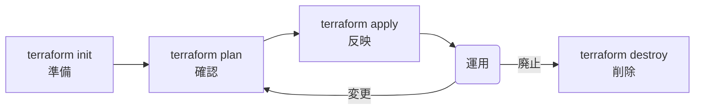
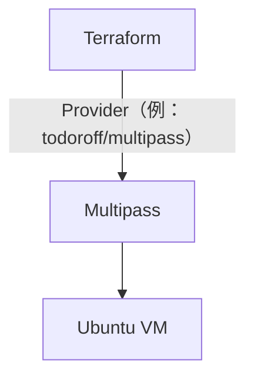
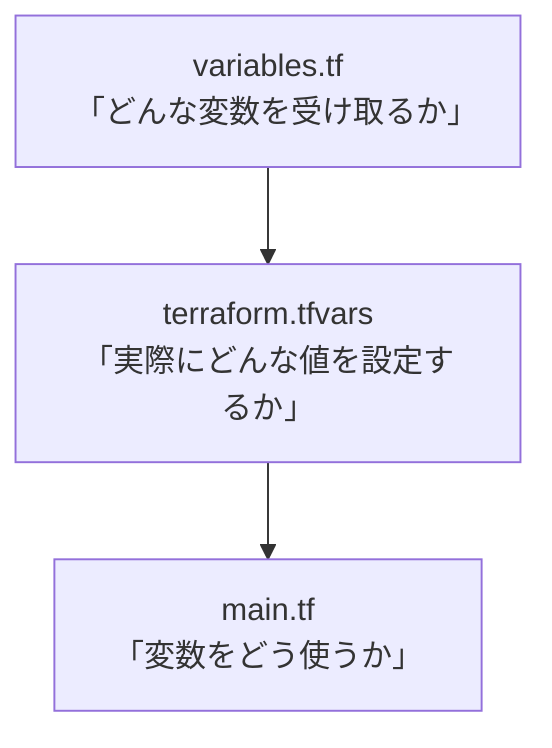
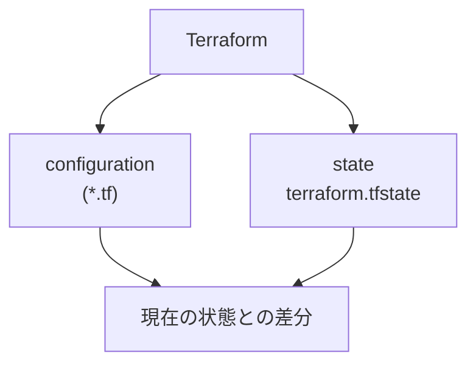
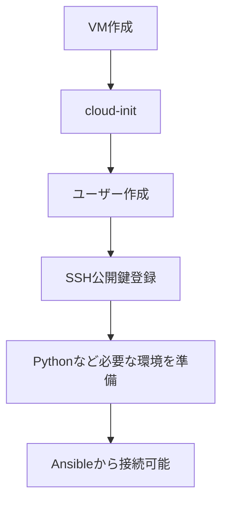
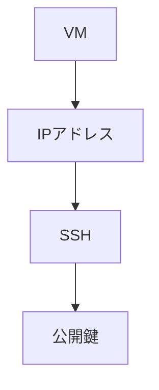

# 6. VM構築

ここからTerraformを使用してVMを構築する。

## 6.1 ディレクトリ構成

今回のサンプルでは、以下の構成とする。

```text
.
├── ansible
│   ├── run_script.yml
│   ├── run_template.yml
│   ├── scripts
│   │   └── hostname.sh
│   └── templates
│       └── motd.j2
└── terraform
    ├── cloud-init.yaml.tftpl
    ├── inventory.ini.tpl
    ├── main.tf
    ├── terraform.tfvars
    ├── terraform.tfvars.example
    └── variables.tf
```

役割は次のとおりである。

| ファイル | 役割 |
| --- | --- |
| `terraform/main.tf` | Multipass VMをTerraformから作成 |
| `terraform/variables.tf` | Terraformの変数定義 |
| `terraform/terraform.tfvars` | 環境固有の変数値（VM構成やSSH鍵パスなど） |
| `terraform/terraform.tfvars.example` | `terraform.tfvars`作成時のひな形 |
| `terraform/cloud-init.yaml.tftpl` | VM初期設定テンプレート |
| `terraform/inventory.ini.tpl` | Ansible inventory生成用テンプレート |
| `ansible/inventory.ini` | Ansibleの接続先（`terraform apply`時に自動生成） |
| `ansible/run_script.yml` | Ansibleの処理内容（15章） |
| `ansible/run_template.yml` | `template` moduleのサンプル処理内容（15.5章） |
| `ansible/scripts/hostname.sh` | MacからVMへ転送して実行するShell |
| `ansible/templates/motd.j2` | VMごとに変数展開して配置するテンプレート |

# 7. Terraform 解説

## 7.1 Terraformの役割

Terraformが担当するのは、主にVMのライフサイクルである。



`terraform plan`は、いきなり実際の変更を行うのではなく「どのような変更が行われるか」を事前に確認するためのコマンドである。`apply`の前に必ず`plan`で差分を確認する、という安全確認の意味を持つ。

Terraform本体がMultipassやAWSなどのサービスを直接操作しているわけではない。実際には、**Provider**と呼ばれるプラグインを介して各種サービスを操作する。



今回の構成では、`todoroff/multipass` というProviderを使ってMultipassのVMを操作する（7.2の`terraform`ブロックで指定する）。

## 7.2 main.tf

```hcl
terraform {
  required_version = ">= 1.6.0"

  required_providers {
    multipass = {
      source  = "todoroff/multipass"
      version = "~> 1.7"
    }
  }
}

locals {
  ssh_public_key = trimspace(
    file(pathexpand(var.ssh_public_key_path))
  )
}

resource "multipass_instance" "node" {
  for_each = var.nodes

  name   = each.key
  image  = var.vm_image
  cpus   = each.value.cpus
  memory = each.value.memory
  disk   = each.value.disk

  cloud_init = templatefile(
    "${path.module}/cloud-init.yaml.tftpl",
    {
      ssh_public_key = local.ssh_public_key
    }
  )
}

resource "local_file" "ansible_inventory" {
  filename = "${path.module}/${var.ansible_inventory_path}"

  content = templatefile(
    "${path.module}/inventory.ini.tpl",
    {
      nodes = {
        for name, node in multipass_instance.node :
        name => node.ipv4[0]
      }

      ssh_private_key_path = var.ssh_private_key_path
    }
  )
}

output "nodes" {
  value = {
    for name, node in multipass_instance.node :
    name => {
      ipv4  = node.ipv4
      state = node.state
    }
  }
}

output "inventory_file" {
  value = local_file.ansible_inventory.filename
}
```

main.tfの各ブロックの役割は次のとおりである。

### `terraform`ブロック

使用するTerraformのバージョンと、Multipassを操作するためのプロバイダ（`todoroff/multipass`）を指定する。プロバイダを介して、TerraformからMultipassのVM作成・削除を行えるようになる。

### `locals`ブロック

`var.ssh_public_key_path`（7.3参照）が指すファイルを読み込み、前後の空白・改行を`trimspace`で取り除いたものを`local.ssh_public_key`として定義する。以降のcloud-init設定（`multipass_instance.node`）で、この値をSSH公開鍵の文字列として使用する。

### `resource "multipass_instance" "node"`

VM本体を作成するリソースである。

- `for_each = var.nodes` により、`terraform.tfvars`（7.4）で定義した`nodes`の数だけVMを作成する。ここではキーがVM名（`each.key`）、値がCPU/メモリ/ディスク設定（`each.value`）になる。

  ```mermaid
  flowchart LR
    N[nodes]
    U1["ubuntu1"]
    U2["ubuntu2"]
    R1["multipass_instance.node[&quot;ubuntu1&quot;]"]
    R2["multipass_instance.node[&quot;ubuntu2&quot;]"]

    N --> U1 --> R1
    N --> U2 --> R2
  ```

  | 式 | 内容 |
  | --- | --- |
  | `each.key` | `ubuntu1`などのVM名 |
  | `each.value` | CPU、メモリ、ディスクなどの設定 |
- `image` / `cpus` / `memory` / `disk` は、それぞれ`var.vm_image`と`each.value`の各項目をVM作成時のスペックとして渡す。
- `cloud_init` は、`cloud-init.yaml.tftpl`（8.2）をテンプレートとして読み込み、`ssh_public_key`に`local.ssh_public_key`を埋め込んだ内容をVMの初期設定として渡す。

### `resource "local_file" "ansible_inventory"`

Ansibleが使用するinventoryファイルをローカルに生成するリソースである。

- `filename` は、`var.ansible_inventory_path`（デフォルト`../ansible/inventory.ini`）で指定した出力先パスになる。
- `content` は、`inventory.ini.tpl`（7.5）をテンプレートとして、`multipass_instance.node`から取得した各VMの名前とIPアドレス（`nodes`）、および`var.ssh_private_key_path`（`ssh_private_key_path`）を埋め込んだ内容になる。
- `multipass_instance.node`の作成が終わり、各VMのIPアドレスが確定したあとにこのリソースが実行されるため、`terraform apply`一回でVM作成とinventory生成が完結する。

### `output`ブロック

`terraform apply`実行後にTerraformが出力する値を定義する。

- `output "nodes"` は、作成した各VMの名前・IPアドレス・状態を確認できるようにする。
- `output "inventory_file"` は、生成されたinventoryファイルのパスを表示する。9.6でのinventory確認時の手がかりになる。

## 7.3 variables.tf

main.tfが参照する変数は、`variables.tf`で定義する。`variables.tf` / `terraform.tfvars` / `main.tf`の3ファイルの関係は次のようになる。



```hcl
variable "nodes" {
  description = "Worker node Lima VM settings"
  type = map(object({
    cpus   = number
    memory = string
    disk   = string
  }))
}

variable "ssh_public_key_path" {
  description = "SSH public key for Ansible connection"
  type        = string
}

variable "ssh_private_key_path" {
  description = "SSH private key for Ansible connection"
  type        = string
}

variable "vm_image" {
  description = "Multipass image to use for provisioned nodes"
  type        = string
  default     = "24.04"
}

variable "ansible_inventory_path" {
  description = "Output path for the generated Ansible inventory file"
  type        = string
  default     = "../ansible/inventory.ini"
}
```

| 変数名 | 役割 | デフォルト値 |
| --- | --- | --- |
| `nodes` | 作成するVMの一覧とCPU/メモリ/ディスク | なし（`terraform.tfvars`で指定必須） |
| `ssh_public_key_path` | cloud-initへ登録するSSH公開鍵のパス | なし（`terraform.tfvars`で指定必須） |
| `ssh_private_key_path` | AnsibleがSSH接続に使う秘密鍵のパス | なし（`terraform.tfvars`で指定必須） |
| `vm_image` | 使用するMultipassイメージ | `24.04` |
| `ansible_inventory_path` | 生成するinventoryファイルの出力先 | `../ansible/inventory.ini` |

## 7.4 terraform.tfvars

`variables.tf`で定義した変数に、環境固有の値を設定する。

今回の例ではSSH鍵のパスやVM構成を記述している。
秘密情報を含む場合はGitなどにコミットしてはいけない。

チームで共有する設定値については、`terraform.tfvars.example`などのサンプルファイルを用意するとよい。

```hcl
nodes = {
  "ubuntu1" = { cpus = 2, memory = "4G", disk = "20G" }
  "ubuntu2" = { cpus = 2, memory = "4G", disk = "20G" }
}

ssh_public_key_path  = "~/.ssh/ansible/id_ed25519.pub"
ssh_private_key_path = "~/.ssh/ansible/id_ed25519"
```

`ssh_public_key_path` / `ssh_private_key_path` には、4.2で作成したSSH鍵のパスを指定する。

## 7.5 inventory.ini.tpl

`local_file.ansible_inventory`が使用するテンプレートである。VM作成後のIPアドレスと、`ssh_private_key_path`（7.3参照）を埋め込み、Ansibleが接続時に使用するinventoryファイルを生成する。

```text
[ubuntu]
%{ for name, ip in nodes ~}
${name} ansible_host=${ip}
%{endfor ~}

[ubuntu:vars]
ansible_user=ansible
ansible_ssh_private_key_file=${ssh_private_key_path}
ansible_python_interpreter=/usr/bin/python3
```

`ansible_ssh_private_key_file`に`ssh_private_key_path`の値が展開されるため、9.6で生成される実際の`inventory.ini`には`[ubuntu:vars]`セクションとしてSSH秘密鍵のパスが含まれる。

## 7.6 terraform.tfstate

Terraformは、設定ファイル（`*.tf`）だけでなく`terraform.tfstate`という状態ファイルを使って、自分が管理しているリソースの現在の状態を把握している。



Terraformは、設定ファイル（`*.tf`）と`terraform.tfstate`を使って、Terraformが管理しているリソースの状態を把握している。

`terraform plan`では、設定ファイルで定義した「あるべき状態」と、現在のリソースの状態を確認し、必要な変更を計画として表示する。

`terraform.tfstate`には、Terraformが管理しているリソースのIDや属性など、実際のリソースを追跡するために必要な情報が保存される。

そのため、`terraform.tfstate`はTerraformにとって重要なファイルであり、通常はGitなどで不用意に共有せず、チーム運用ではリモートBackendなどを利用して管理する。

# 8. cloud-init概要

## 8.1 cloud-initとは

cloud-initは、VMやクラウドインスタンスの初回起動時に初期設定を行う仕組みである。

例えば、

- ユーザー作成
- SSH公開鍵登録
- パッケージインストール
- ファイル作成
- 初期設定

などを自動化できる。

今回の構成でcloud-initを使う理由は、単なる初期設定の自動化ではなく、**Ansibleが接続できる状態をVM作成時点で用意しておくため**である。



この流れを踏まえないと、VMは作成できてもAnsibleから操作できない状態になってしまう。

## 8.2 cloud-init.yaml

```yaml
#cloud-config

users:
  - default

  - name: ansible
    gecos: Ansible user
    shell: /bin/bash
    groups:
      - sudo
    sudo:
      - ALL=(ALL) NOPASSWD:ALL
    lock_passwd: true
    ssh_authorized_keys:
      - ${ssh_public_key}

ssh_pwauth: false
disable_root: true

packages:
  - python3
  - python3-apt
```

`${ssh_public_key}`の部分は、手動で書き換える必要はない。main.tf（7.2）が`templatefile()`関数でこのテンプレートを読み込む際に、`terraform.tfvars`の`ssh_public_key_path`（7.4）で指定したSSH公開鍵の内容を自動的に埋め込む。

# 9. VM構築の実行

## 9.1 Terraformディレクトリへ移動

```bash
$ cd terraform
```

## 9.2 Terraformの実行

```bash
$ terraform init  # Terraform初期化

Initializing provider plugins found in the configuration...
- Finding todoroff/multipass versions matching "~> 1.7"...
(略)

$ terraform plan  # 実行計画を確認

Terraform used the selected providers to generate the following execution plan. Resource actions are indicated with the
following symbols:
  + create

Terraform will perform the following actions:
(略)

$ terraform apply  # 計画を実行（VM作成）

Terraform used the selected providers to generate the following execution plan. Resource actions are indicated with the
following symbols:
  + create

Terraform will perform the following actions:
(略)
Do you want to perform these actions?
  Terraform will perform the actions described above.
  Only 'yes' will be accepted to approve.

  Enter a value:   # "yes"を入力

multipass_instance.node["ubuntu2"]: Creating...
multipass_instance.node["ubuntu1"]: Creating...
(略)
multipass_instance.node["ubuntu2"]: Creation complete after 46s [id=ubuntu2]
multipass_instance.node["ubuntu1"]: Creation complete after 47s [id=ubuntu1]
local_file.ansible_inventory: Creating...
local_file.ansible_inventory: Creation complete after 0s [id=6eb48d3dbba0c534c6ed9323bd6324815e507baa]

Apply complete! Resources: 3 added, 0 changed, 0 destroyed.

Outputs:

inventory_file = "./../ansible/inventory.ini"
nodes = {
  "ubuntu1" = {
    "ipv4" = tolist([
      "192.168.252.xx",
    ])
    "state" = "Running"
  }
  "ubuntu2" = {
    "ipv4" = tolist([
      "192.168.252.xx",
    ])
    "state" = "Running"
  }
}
```

## 9.3 Multipassの状態確認

```bash
multipass list
```

以下のように2台のVMが表示されれば成功である。

```text
Name                    State             IPv4
ubuntu1            RUNNING           192.168.x.x
ubuntu2            RUNNING           192.168.x.x
```

## 9.4 Inventory確認

```bash
cat ../ansible/inventory.ini
```

例：

```ini
[ubuntu]
ubuntu1 ansible_host=192.168.64.xx
ubuntu2 ansible_host=192.168.64.xx

[ubuntu:vars]
ansible_user=ansible
ansible_ssh_private_key_file=~/.ssh/ansible/id_ed25519
ansible_python_interpreter=/usr/bin/python3
```

これでAnsibleが接続する対象が決まる。

## 9.5 VMの削除（terraform destroy）

ワークショップ終了時や環境を作り直したい場合は、`terraform destroy`でVMを削除する。

```bash
$ terraform destroy

multipass_instance.node["ubuntu1"]: Refreshing state... [id=ubuntu1]
multipass_instance.node["ubuntu2"]: Refreshing state... [id=ubuntu2]
(略)
Do you really want to destroy all resources?
  Terraform will destroy all your managed infrastructure, as shown above.
  There is no undo. Only 'yes' will be accepted to confirm.

  Enter a value:   # "yes"を入力

local_file.ansible_inventory: Destroying... [id=6eb48d3dbba0c534c6ed9323bd6324815e507baa]
local_file.ansible_inventory: Destruction complete after 0s
multipass_instance.node["ubuntu2"]: Destroying... [id=ubuntu2]
multipass_instance.node["ubuntu1"]: Destroying... [id=ubuntu1]
multipass_instance.node["ubuntu1"]: Destruction complete after 4s
multipass_instance.node["ubuntu2"]: Destruction complete after 4s

Destroy complete! Resources: 3 destroyed.
```

`multipass list`で対象VMが表示されなくなれば削除は完了である。

## 9.6 SSH接続の確認

VMを作成したので、Ansibleを使う前にSSHそのものが正常に使えるか確認しておくと切り分けが楽になる。接続ユーザーは、cloud-init（8.2）で作成した`ansible`である。

```bash
ssh -i ~/.ssh/ansible/id_ed25519 ansible@<VMのIPアドレス>
```

例えば、

```bash
ssh -i ~/.ssh/ansible/id_ed25519 ansible@192.168.64.10
```

である。初回接続時はSSHのホスト鍵確認プロンプト（`Are you sure you want to continue connecting (yes/no/[fingerprint])?`）が表示されることがあるが、その場合は`yes`と入力する。

SSH接続できない場合、Ansibleを調査する前に、



の順に確認する。

# 10. トラブルシューティング

## 10.1 Multipassのトラブルシューティング

### 10.1.1 Multipass自体の状態確認

Multipassのサービス側に問題がある場合は、まずMultipass自体の状態を確認する。

```bash
multipass version
```

バージョン情報が表示されない場合は、Multipassの再インストールやMac再起動を試みる。

```bash
multipass list
```

が正常に実行できるか確認する。Mac側のMultipassアプリケーションやサービスが正常に動作しているかも確認する。

### 10.1.2 VM一覧・詳細の確認

```bash
multipass list
```

を確認する。

```text
Name                    State             IPv4
ubuntu1                 RUNNING           192.168.x.x
ubuntu2                 RUNNING           192.168.x.x
```

確認するポイント：

- VMが存在するか
- `RUNNING`になっているか
- IPv4アドレスが存在するか

より詳細な情報は、以下で確認できる。

```bash
multipass info ubuntu1
```

### 10.1.3 VMにログインできるか確認

Ansibleを疑う前に、まずMultipass自身からVMに入れるか確認する。

```bash
multipass shell ubuntu1
```

ログインできたら、

```bash
hostname
```

などを実行する。

## 10.2 terraform applyが失敗する・タイムアウトする

- `terraform init`が完了しているか確認する。プロバイダのダウンロードに失敗している場合は再実行する。

  ```bash
  terraform init -upgrade
  ```

- VM作成後にcloud-initの処理待ちでタイムアウトする場合は、対象VMへ`multipass shell`でログインし、以下でcloud-initの状態を確認する。

  ```bash
  cloud-init status
  ```

  `done`と表示されれば初期設定は完了している。`error`の場合は`/var/log/cloud-init-output.log`を確認する。

## 10.3 terraform applyをやり直したい場合

- VMが中途半端な状態で残った場合は、一度`multipass delete --purge`で該当VMを削除し、`terraform apply`を再実行する。
- `terraform.tfstate`とMultipass側の実態がずれてしまった場合は、`terraform refresh`で状態を同期してから再実行する。

---

[← 前へ：002：事前準備とMultipassの基本操作](002_terraform_ansible_workshop.md) | [目次](001_terraform_ansible_workshop.md#目次) | [次へ：004：Ansibleの実行・Playbook解説・演習問題 →](004_terraform_ansible_workshop.md)
