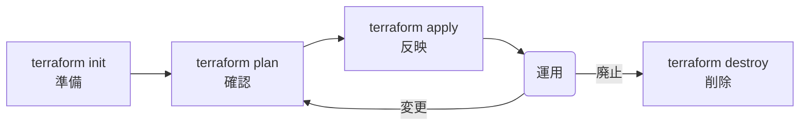
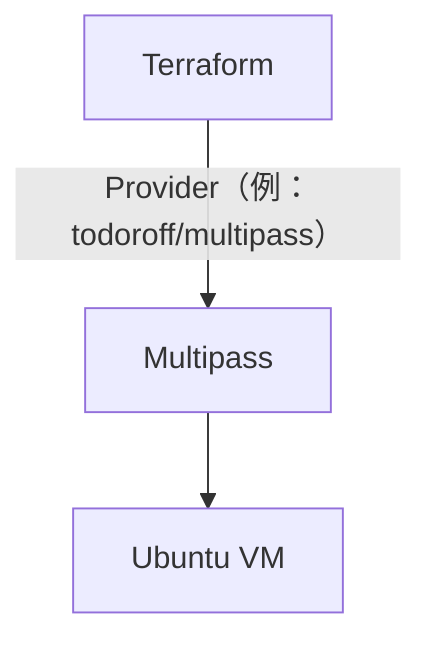
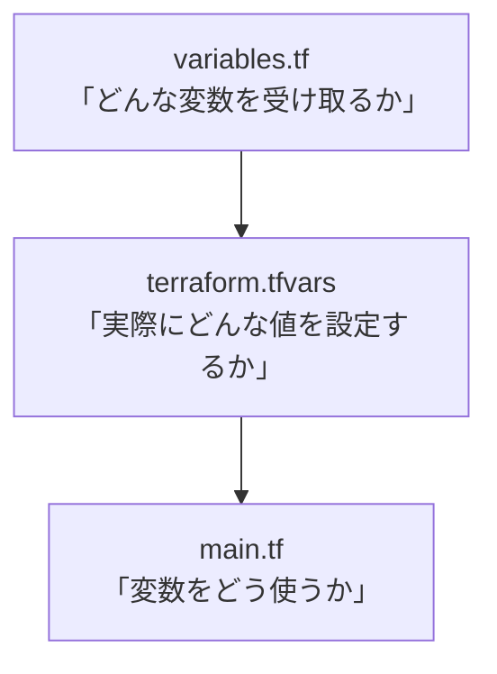
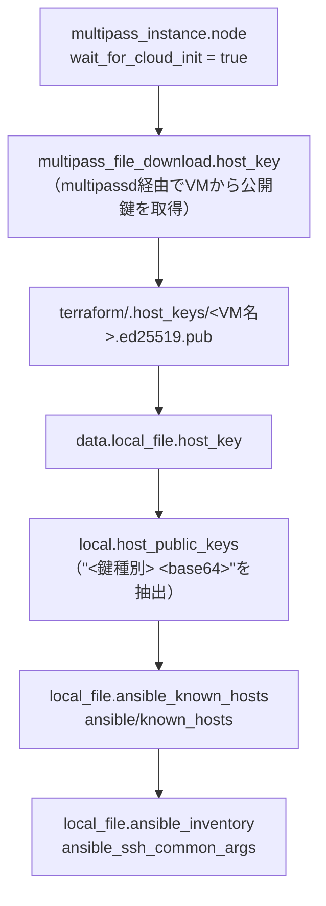
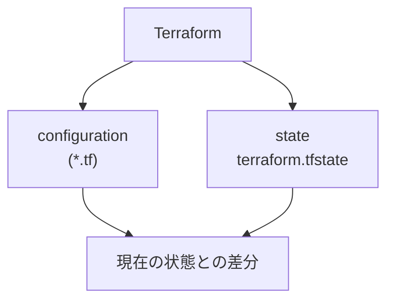
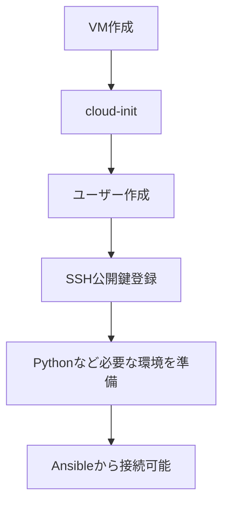
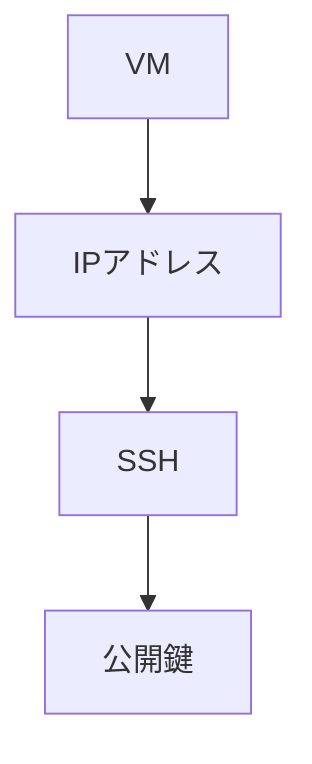

# 6. VM構築

ここからTerraformを使用してVMを構築する。

## 6.1 ディレクトリ構成

今回のサンプルでは、以下の構成とする。

```text
.
├── ansible
│   ├── run_script.yml
│   ├── run_template.yml
│   ├── scripts
│   │   └── hostname.sh
│   └── templates
│       └── motd.j2
└── terraform
    ├── inventory.ini.tpl
    ├── main.tf
    ├── terraform.tfvars
    ├── terraform.tfvars.example
    ├── tests
    │   └── host_keys.tftest.hcl
    └── variables.tf
```

役割は次のとおりである。

| ファイル | 役割 |
| --- | --- |
| `terraform/main.tf` | Multipass VMをTerraformから作成 |
| `terraform/variables.tf` | Terraformの変数定義 |
| `terraform/terraform.tfvars` | 環境固有の変数値（VM構成やSSH鍵パスなど） |
| `terraform/terraform.tfvars.example` | `terraform.tfvars`作成時のひな形 |
| `terraform/inventory.ini.tpl` | Ansible inventory生成用テンプレート |
| `terraform/tests/host_keys.tftest.hcl` | `terraform test`用のテスト（7.6参照、VMは作成しない） |
| `terraform/.host_keys/<VM名>.ed25519.pub` | 各VMからダウンロードしたSSHホスト公開鍵（`terraform apply`時に自動生成、Git管理対象外） |
| `ansible/inventory.ini` | Ansibleの接続先（`terraform apply`時に自動生成） |
| `ansible/known_hosts` | AnsibleのSSHホスト鍵確認用ファイル（`terraform apply`時に自動生成、Git管理対象外、7.6参照） |
| `ansible/run_script.yml` | Ansibleの処理内容（15章） |
| `ansible/run_template.yml` | `template` moduleのサンプル処理内容（15.5章） |
| `ansible/scripts/hostname.sh` | MacからVMへ転送して実行するShell |
| `ansible/templates/motd.j2` | VMごとに変数展開して配置するテンプレート |

# 7. Terraform 解説

## 7.1 Terraformの役割

Terraformが担当するのは、主にVMのライフサイクルである。



`terraform plan`は、いきなり実際の変更を行うのではなく「どのような変更が行われるか」を事前に確認するためのコマンドである。`apply`の前に必ず`plan`で差分を確認する、という安全確認の意味を持つ。

Terraform本体がMultipassやAWSなどのサービスを直接操作しているわけではない。実際には、**Provider**と呼ばれるプラグインを介して各種サービスを操作する。



今回の構成では、`todoroff/multipass` というProviderを使ってMultipassのVMを操作する（7.2の`terraform`ブロックで指定する）。

## 7.2 main.tf

```hcl
terraform {
  required_version = ">= 1.6.0"

  required_providers {
    multipass = {
      source  = "todoroff/multipass"
      version = "~> 1.7"
    }

    local = {
      source  = "hashicorp/local"
      version = "~> 2.5"
    }
  }
}

locals {
  ssh_public_key_raw = trimspace(
    file(pathexpand(var.ssh_public_key_path))
  )

  # Matches "<type> <base64>" at the start of an OpenSSH public key line,
  # covering the standard key types plus FIDO2/U2F "sk-" variants. Anything
  # after the base64 field (the free-form comment) is intentionally ignored.
  ssh_public_key_regex = "^(ssh-[a-z0-9-]+|ecdsa-sha2-[a-z0-9-]+|sk-[a-z0-9-]+@openssh\\.com) +([A-Za-z0-9+/=]+)"

  # try() avoids a hard crash here so the precondition below can report a
  # clear, actionable error instead of a raw regex failure.
  ssh_public_key_match = try(regex(local.ssh_public_key_regex, local.ssh_public_key_raw), null)

  # Reconstruct the key as "<type> <base64>" only, dropping the comment.
  # OpenSSH ignores the comment for authentication, and it is the primary
  # source of unpredictable, user-edited content, so it is intentionally not
  # carried into the rendered cloud-init document. yamlencode() below would
  # already safely escape any comment content, but stripping it removes the
  # highest-risk portion of the string as defense in depth.
  ssh_public_key = local.ssh_public_key_match == null ? "" : "${local.ssh_public_key_match[0]} ${local.ssh_public_key_match[1]}"

  # Cloud-init document for each node, built as an HCL structure so that
  # yamlencode() produces well-formed YAML regardless of the content of
  # ssh_public_key. This replaces the former cloud-init.yaml.tftpl.
  cloud_init_config = {
    users = [
      "default",
      {
        name        = "ansible"
        gecos       = "Ansible user"
        shell       = "/bin/bash"
        groups      = ["sudo"]
        sudo        = ["ALL=(ALL) NOPASSWD:ALL"]
        lock_passwd = true
        ssh_authorized_keys = [
          local.ssh_public_key
        ]
      }
    ]

    ssh_pwauth   = false
    disable_root = true

    packages = [
      "python3",
      "python3-apt"
    ]
  }
}

resource "multipass_instance" "node" {
  for_each = var.nodes

  name   = each.key
  image  = var.vm_image
  cpus   = each.value.cpus
  memory = each.value.memory
  disk   = each.value.disk

  # #cloud-config is prepended literally since yamlencode() only emits the
  # YAML body, not the leading marker cloud-init requires.
  cloud_init = "#cloud-config\n${yamlencode(local.cloud_init_config)}"

  # Block until cloud-init has finished so that the SSH host keys (read by
  # multipass_file_download.host_key below) and python3 (needed by Ansible)
  # exist before any downstream resource runs.
  wait_for_cloud_init = true

  lifecycle {
    precondition {
      # Validates that the file at var.ssh_public_key_path actually contains
      # an OpenSSH public key, since yamlencode() only guarantees
      # syntactically valid YAML, not syntactically valid key content (e.g. a
      # typo'd path pointing at a private key or an empty file). Unlike a
      # `check` block (advisory-only: prints a warning but lets plan/apply
      # succeed), a lifecycle precondition hard-fails plan/apply, which is
      # required here since a passing apply with an empty
      # ssh_authorized_keys entry would silently create an unreachable VM.
      condition     = local.ssh_public_key_match != null
      error_message = "The SSH public key at var.ssh_public_key_path (\"${var.ssh_public_key_path}\") does not look like a valid OpenSSH public key. Expected format: \"<type> <base64> [comment]\", e.g. \"ssh-ed25519 AAAA... user@host\". Check that the path points at a public key file (not a private key) and that it is not empty or corrupted."
    }
  }
}

# Fetch each VM's SSH host *public* key through Multipass (`multipass
# transfer`). This channel goes through the local multipassd daemon, not SSH,
# so it cannot be intercepted by an SSH man-in-the-middle. The host private
# key never leaves the VM and is never stored in Terraform state.
resource "multipass_file_download" "host_key" {
  for_each = multipass_instance.node

  instance       = each.value.name
  source         = "/etc/ssh/ssh_host_ed25519_key.pub"
  destination    = "${path.module}/.host_keys/${each.key}.ed25519.pub"
  create_parents = true
  overwrite      = true

  lifecycle {
    # A replaced VM has a new host key, so download it again.
    replace_triggered_by = [multipass_instance.node[each.key]]
  }
}

data "local_file" "host_key" {
  for_each = multipass_file_download.host_key

  filename = each.value.destination
}

locals {
  # "<type> <base64>" per node, with the "root@<host>" comment dropped. null
  # marks a file that does not look like an OpenSSH public key; the
  # precondition on local_file.ansible_known_hosts reports it.
  host_public_keys = {
    for name, key_file in data.local_file.host_key :
    name => try(join(" ", regex(local.ssh_public_key_regex, trimspace(key_file.content))), null)
  }
}

resource "local_file" "ansible_known_hosts" {
  filename        = "${path.module}/${var.ansible_known_hosts_path}"
  file_permission = "0644"

  content = join("", [
    for name, node in multipass_instance.node :
    "${node.ipv4[0]} ${local.host_public_keys[name]}\n"
  ])

  lifecycle {
    precondition {
      condition     = alltrue([for key in values(local.host_public_keys) : key != null])
      error_message = "One or more SSH host public keys downloaded to terraform/.host_keys/ are not valid OpenSSH public keys. Re-download them with: terraform apply -replace='multipass_file_download.host_key[\"<node>\"]'"
    }
  }
}

resource "local_file" "ansible_inventory" {
  filename = "${path.module}/${var.ansible_inventory_path}"

  content = templatefile(
    "${path.module}/inventory.ini.tpl",
    {
      nodes = {
        for name, node in multipass_instance.node :
        name => node.ipv4[0]
      }

      ssh_private_key_path = var.ssh_private_key_path

      # Absolute, because OpenSSH resolves UserKnownHostsFile relative to the
      # directory ansible is run from.
      known_hosts_path = abspath(local_file.ansible_known_hosts.filename)
    }
  )
}

output "nodes" {
  value = {
    for name, node in multipass_instance.node :
    name => {
      ipv4  = node.ipv4
      state = node.state
    }
  }
}

output "inventory_file" {
  value = local_file.ansible_inventory.filename
}
```

main.tfの各ブロックの役割は次のとおりである。

### `terraform`ブロック

使用するTerraformのバージョンと、Multipassを操作するためのプロバイダ（`todoroff/multipass`）を指定する。プロバイダを介して、TerraformからMultipassのVM作成・削除を行えるようになる。

`hashicorp/local`は、ローカルファイル（`ansible/known_hosts`や`ansible/inventory.ini`）を読み書きするための公式プロバイダである。SSHホスト鍵のPinning（7.6）で使用する。

### `locals`ブロック

`var.ssh_public_key_path`（7.3参照）が指すファイルを読み込み、前後の空白・改行を`trimspace`で取り除いたものを`local.ssh_public_key_raw`として定義する。

`local.ssh_public_key_raw`は、正規表現`local.ssh_public_key_regex`（`"<鍵種別> <base64>"`という先頭部分にマッチ）で`local.ssh_public_key_match`として解析される。マッチした場合は`<鍵種別>`と`<base64>`のみを組み立て直したものを`local.ssh_public_key`とし、末尾のコメント（`user@host`のような自由記述部分）はあえて除去する。これはOpenSSHの認証にコメントが不要である一方、コメントは内容が予測できない（YAMLで特別な意味を持つ文字を含みうる）ため、リスクの高い部分を先に取り除いておく多重の安全対策である。

`local.ssh_public_key_match`が`null`（＝正規表現にマッチしない＝OpenSSHの公開鍵として不正な内容）の場合は、`local.ssh_public_key`は空文字列になる。この状態のまま`terraform apply`が進んでしまわないよう、`multipass_instance.node`（後述）に`precondition`によるチェックが用意されている。

`local.cloud_init_config`は、cloud-initに渡す設定内容をYAMLの文字列としてではなく、HCLのマップ（オブジェクト）として定義したものである。中身は8.2で説明するcloud-init.yamlと同じ構造（`users` / `ssh_pwauth` / `disable_root` / `packages`）を持つ。

### `resource "multipass_instance" "node"`

VM本体を作成するリソースである。

- `for_each = var.nodes` により、`terraform.tfvars`（7.4）で定義した`nodes`の数だけVMを作成する。ここではキーがVM名（`each.key`）、値がCPU/メモリ/ディスク設定（`each.value`）になる。

  ```mermaid
  flowchart LR
    N[nodes]
    U1["ubuntu1"]
    U2["ubuntu2"]
    R1["multipass_instance.node[&quot;ubuntu1&quot;]"]
    R2["multipass_instance.node[&quot;ubuntu2&quot;]"]

    N --> U1 --> R1
    N --> U2 --> R2
  ```

  | 式 | 内容 |
  | --- | --- |
  | `each.key` | `ubuntu1`などのVM名 |
  | `each.value` | CPU、メモリ、ディスクなどの設定 |
- `image` / `cpus` / `memory` / `disk` は、それぞれ`var.vm_image`と`each.value`の各項目をVM作成時のスペックとして渡す。
- `cloud_init` は、`local.cloud_init_config`（HCLのマップ）を`yamlencode()`関数でYAML文字列に変換し、先頭に`#cloud-config`というマーカーを付与した内容をVMの初期設定として渡す（詳細は8.2）。`yamlencode()`を使うことで、`local.ssh_public_key`にYAMLの特殊文字（コロンや`*`、`&`など）が含まれていた場合でも、常に構文的に正しいYAMLが生成される。
- `wait_for_cloud_init = true` は、cloud-initの完了を待ってから`terraform apply`を先へ進める設定である。これにより、次で説明する`multipass_file_download.host_key`がSSHホスト鍵を読みに行く時点で、VM側のcloud-init（SSHホスト鍵生成・`python3`インストールなど）が確実に終わっている状態になる。
- `lifecycle`ブロックの`precondition`は、`local.ssh_public_key_match`が`null`（＝`var.ssh_public_key_path`の内容がOpenSSHの公開鍵として不正）の場合に、`terraform plan` / `apply`をエラーで停止させる。これにより、SSH公開鍵が正しく読み込めていない状態のままVMが作成され、Ansibleから接続できない状態になることを防ぐ。

### `resource "multipass_file_download" "host_key"` 〜 `resource "local_file" "ansible_known_hosts"`

SSHホスト鍵のPinningに関わる一連のリソースである。詳細な理由は7.6でまとめて説明するが、main.tf上の役割は次のとおりである。

- `multipass_file_download.host_key` は、各VM（`multipass_instance.node`）の`/etc/ssh/ssh_host_ed25519_key.pub`（SSHホスト**公開**鍵）を、`multipass transfer`相当の仕組みで`terraform/.host_keys/<VM名>.ed25519.pub`にダウンロードする。`lifecycle.replace_triggered_by`により、VMが再作成された場合は鍵を再ダウンロードする。
- `data.local_file.host_key` は、ダウンロードした鍵ファイルの内容を読み込む。
- 2番目の`locals`ブロックの`host_public_keys`は、読み込んだ内容から正規表現（`local.ssh_public_key_regex`）で`"<鍵種別> <base64>"`部分だけを取り出す。ファイルがOpenSSHの公開鍵として解析できない場合は`null`になる。
- `local_file.ansible_known_hosts` は、各VMのIPアドレスと`local.host_public_keys`を`"<IP> <鍵種別> <base64>"`という形式で1行ずつ結合し、`var.ansible_known_hosts_path`（デフォルト`../ansible/known_hosts`）に書き出す。`lifecycle.precondition`は、`host_public_keys`のいずれかが`null`（＝鍵ファイルが不正）だった場合に、再ダウンロード方法を示すエラーメッセージとともに`apply`を停止させる。

### `resource "local_file" "ansible_inventory"`

Ansibleが使用するinventoryファイルをローカルに生成するリソースである。

- `filename` は、`var.ansible_inventory_path`（デフォルト`../ansible/inventory.ini`）で指定した出力先パスになる。
- `content` は、`inventory.ini.tpl`（7.5）をテンプレートとして、`multipass_instance.node`から取得した各VMの名前とIPアドレス（`nodes`）、`var.ssh_private_key_path`（`ssh_private_key_path`）、および`local_file.ansible_known_hosts`の絶対パス（`known_hosts_path`）を埋め込んだ内容になる。絶対パスにしているのは、OpenSSHが`UserKnownHostsFile`をAnsible実行時のカレントディレクトリ（`ansible/`）基準で解決するためである。
- `multipass_instance.node`の作成が終わり、各VMのIPアドレスが確定し、`local_file.ansible_known_hosts`が生成されたあとにこのリソースが実行されるため、`terraform apply`一回でVM作成・known_hosts生成・inventory生成が完結する。

### `output`ブロック

`terraform apply`実行後にTerraformが出力する値を定義する。

- `output "nodes"` は、作成した各VMの名前・IPアドレス・状態を確認できるようにする。
- `output "inventory_file"` は、生成されたinventoryファイルのパスを表示する。9.6でのinventory確認時の手がかりになる。

## 7.3 variables.tf

main.tfが参照する変数は、`variables.tf`で定義する。`variables.tf` / `terraform.tfvars` / `main.tf`の3ファイルの関係は次のようになる。



```hcl
variable "nodes" {
  description = "Worker node Lima VM settings"
  type = map(object({
    cpus   = number
    memory = string
    disk   = string
  }))
}

variable "ssh_public_key_path" {
  description = "SSH public key for Ansible connection"
  type        = string
}

variable "ssh_private_key_path" {
  description = "SSH private key for Ansible connection"
  type        = string
}

variable "vm_image" {
  description = "Multipass image to use for provisioned nodes"
  type        = string
  default     = "24.04"
}

variable "ansible_inventory_path" {
  description = "Output path for the generated Ansible inventory file"
  type        = string
  default     = "../ansible/inventory.ini"
}

variable "ansible_known_hosts_path" {
  description = "Output path for the generated SSH known_hosts file used by Ansible"
  type        = string
  default     = "../ansible/known_hosts"
}
```

| 変数名 | 役割 | デフォルト値 |
| --- | --- | --- |
| `nodes` | 作成するVMの一覧とCPU/メモリ/ディスク | なし（`terraform.tfvars`で指定必須） |
| `ssh_public_key_path` | cloud-initへ登録するSSH公開鍵のパス | なし（`terraform.tfvars`で指定必須） |
| `ssh_private_key_path` | AnsibleがSSH接続に使う秘密鍵のパス | なし（`terraform.tfvars`で指定必須） |
| `vm_image` | 使用するMultipassイメージ | `24.04` |
| `ansible_inventory_path` | 生成するinventoryファイルの出力先 | `../ansible/inventory.ini` |
| `ansible_known_hosts_path` | 生成するknown_hostsファイルの出力先（7.6参照） | `../ansible/known_hosts` |

## 7.4 terraform.tfvars

`variables.tf`で定義した変数に、環境固有の値を設定する。

今回の例ではSSH鍵のパスやVM構成を記述している。
秘密情報を含む場合はGitなどにコミットしてはいけない。

チームで共有する設定値については、`terraform.tfvars.example`などのサンプルファイルを用意するとよい。

```hcl
nodes = {
  "ubuntu1" = { cpus = 2, memory = "4G", disk = "20G" }
  "ubuntu2" = { cpus = 2, memory = "4G", disk = "20G" }
}

ssh_public_key_path  = "~/.ssh/ansible/id_ed25519.pub"
ssh_private_key_path = "~/.ssh/ansible/id_ed25519"
```

`ssh_public_key_path` / `ssh_private_key_path` には、4.2で作成したSSH鍵のパスを指定する。

## 7.5 inventory.ini.tpl

`local_file.ansible_inventory`が使用するテンプレートである。VM作成後のIPアドレスと、`ssh_private_key_path` / `known_hosts_path`（7.3参照）を埋め込み、Ansibleが接続時に使用するinventoryファイルを生成する。

```text
[ubuntu]
%{ for name, ip in nodes ~}
${name} ansible_host=${ip}
%{endfor ~}

[ubuntu:vars]
ansible_user=ansible
ansible_ssh_private_key_file=${ssh_private_key_path}
ansible_python_interpreter=/usr/bin/python3
ansible_ssh_common_args='-o StrictHostKeyChecking=yes -o UserKnownHostsFile="${known_hosts_path}"'
```

`ansible_ssh_private_key_file`に`ssh_private_key_path`の値が展開されるため、9.4で生成される実際の`inventory.ini`には`[ubuntu:vars]`セクションとしてSSH秘密鍵のパスが含まれる。

`ansible_ssh_common_args`は、Ansibleが内部で実行するSSHコマンドに常に付与される追加オプションである。ここでは`-o StrictHostKeyChecking=yes -o UserKnownHostsFile="<known_hostsの絶対パス>"`を渡し、7.6で生成される`ansible/known_hosts`だけをホスト鍵の検証対象にする。これにより、初回接続時のプロンプトが出ず、`~/.ssh/known_hosts`にも一切書き込まれない。

## 7.6 SSHホスト鍵のPinning（`ansible/known_hosts`）

### 7.6.1 課題

各VMは、cloud-initの初回起動時にSSHホスト鍵をランダムに生成する。7.5の`ansible_ssh_common_args`を追加する前は、OpenSSHが`~/.ssh/known_hosts`を使う既定の挙動（`StrictHostKeyChecking=ask`）に依存していたため、次のような問題があった。

- 初回のAnsible実行時に`Are you sure you want to continue connecting (yes/no/[fingerprint])?`という確認プロンプトが表示される。複数ホストへ並列接続すると、このプロンプトが競合して失敗・ハングすることがある。
- `terraform destroy` → `apply`でVMを作り直すと、MultipassがIPを再利用しつつ新しいホスト鍵を生成することが多く、`REMOTE HOST IDENTIFICATION HAS CHANGED`エラーになる。手元の`~/.ssh/known_hosts`を人手で編集しないと復旧できない。

### 7.6.2 対応方針

`StrictHostKeyChecking=no`のように検証そのものを無効化するのは簡単だが、ホスト認証を無意味にしてしまうため採用しない。また、SSHホスト鍵をTerraform側（`tls_private_key`）で生成してcloud-init経由でVMへ注入する方法も検討したが、秘密鍵が`terraform.tfstate`とcloud-initのuser-dataに平文で残ってしまう（tfstateをリモートBackendに置く場合や、クラウド環境でuser-dataがメタデータサービス経由で読める場合に問題になる）ため採用しなかった。

代わりに、次の方針を採った。

- SSHホスト鍵はこれまでと同様、各VM内部で生成させる。**秘密鍵はVMの外へ一切出さない。**
- Terraformは、VMのSSHホスト**公開**鍵だけを、Multipassのファイル転送機能（`multipass transfer`相当、`multipass_file_download`リソース）経由で取得する。この経路はSSHではなくローカルの`multipassd`デーモンを介するため、SSH越しのMITM（中間者攻撃）の影響を受けない。
- 取得した公開鍵から`ansible/known_hosts`を生成し、Ansibleにはそのファイルだけをホスト鍵検証の対象として使わせる（7.5の`ansible_ssh_common_args`）。

### 7.6.3 処理の流れ



main.tf上の各リソースの詳細は7.2を参照。

### 7.6.4 クラウド環境への応用

この「信頼できるアウトオブバンドな経路で公開鍵を取得する」というパターンは、Multipass以外の環境にもそのまま応用できる。例えば、AWSであればコンソール出力（EC2 console output）、GCPであればGuest Attributesなど、クラウドプロバイダが提供する認証済みAPIから同様にホスト公開鍵を取得できる。

### 7.6.5 自動テスト（`terraform test`）

`terraform/tests/host_keys.tftest.hcl`には、上記の一連の変換ロジック（ダウンロードした鍵の解析・`known_hosts`の内容・inventoryの`ansible_ssh_common_args`・不正な鍵に対するエラー）を検証する`terraform test`が用意されている。`multipass`・`local`プロバイダを`mock_provider`でモックしているため、実際のVM作成やファイル書き込みは発生しない。

```bash
cd terraform
terraform test
```

## 7.7 terraform.tfstate

Terraformは、設定ファイル（`*.tf`）だけでなく`terraform.tfstate`という状態ファイルを使って、自分が管理しているリソースの現在の状態を把握している。



Terraformは、設定ファイル（`*.tf`）と`terraform.tfstate`を使って、Terraformが管理しているリソースの状態を把握している。

`terraform plan`では、設定ファイルで定義した「あるべき状態」と、現在のリソースの状態を確認し、必要な変更を計画として表示する。

`terraform.tfstate`には、Terraformが管理しているリソースのIDや属性など、実際のリソースを追跡するために必要な情報が保存される。

そのため、`terraform.tfstate`はTerraformにとって重要なファイルであり、通常はGitなどで不用意に共有せず、チーム運用ではリモートBackendなどを利用して管理する。

# 8. cloud-init概要

## 8.1 cloud-initとは

cloud-initは、VMやクラウドインスタンスの初回起動時に初期設定を行う仕組みである。

例えば、

- ユーザー作成
- SSH公開鍵登録
- パッケージインストール
- ファイル作成
- 初期設定

などを自動化できる。

今回の構成でcloud-initを使う理由は、単なる初期設定の自動化ではなく、**Ansibleが接続できる状態をVM作成時点で用意しておくため**である。



この流れを踏まえないと、VMは作成できてもAnsibleから操作できない状態になってしまう。

## 8.2 cloud-initの生成方法

cloud-initに渡す設定内容は、`cloud-init.yaml`のような静的なYAMLテンプレートファイルとしては用意されていない。代わりに、main.tf（7.2）の`locals.cloud_init_config`でHCLのマップとして定義し、`yamlencode()`関数でYAML文字列に変換する、という方法で生成している。

```hcl
cloud_init = "#cloud-config\n${yamlencode(local.cloud_init_config)}"
```

`local.cloud_init_config`（main.tf、7.2参照）の内容は、次のとおりである。

```hcl
cloud_init_config = {
  users = [
    "default",
    {
      name        = "ansible"
      gecos       = "Ansible user"
      shell       = "/bin/bash"
      groups      = ["sudo"]
      sudo        = ["ALL=(ALL) NOPASSWD:ALL"]
      lock_passwd = true
      ssh_authorized_keys = [
        local.ssh_public_key
      ]
    }
  ]

  ssh_pwauth   = false
  disable_root = true

  packages = [
    "python3",
    "python3-apt"
  ]
}
```

`yamlencode()`はこのマップを受け取り、次のようなYAMLを生成する（`local.ssh_public_key`の実際の値が展開された状態）。`#cloud-config`はcloud-initが要求する先頭マーカーであり、`yamlencode()`はYAML本体しか生成しないため、main.tf側で文字列結合により手動で付与している。

```yaml
#cloud-config
disable_root: true
packages:
  - python3
  - python3-apt
ssh_pwauth: false
users:
  - default
  - gecos: Ansible user
    groups:
      - sudo
    lock_passwd: true
    name: ansible
    shell: /bin/bash
    ssh_authorized_keys:
      - ssh-ed25519 AAAA...
    sudo:
      - ALL=(ALL) NOPASSWD:ALL
```

内容（ユーザー作成、SSH公開鍵登録、パッケージインストールなどの設定項目）自体は、以前の`cloud-init.yaml.tftpl`テンプレートと変わらない。変わったのは、その内容を**手書きのYAMLテンプレート**として用意するか、**HCLのデータ構造**として定義し`yamlencode()`で変換するか、という生成方法の部分である。

この方式に変更した理由は、YAMLとしての安全性を保証するためである。手書きのYAMLテンプレートに`${ssh_public_key}`のような形で値を文字列展開する場合、その値（今回であればSSH公開鍵）にコロン（`:`）や`*`、`&`、`!`など、YAMLで特別な意味を持つ文字が含まれていると、生成されるYAML自体が壊れてしまう可能性がある。特にSSH公開鍵の末尾のコメント（`user@host`など）は利用者が自由に書き換えられる部分であり、内容を予測できない。

`yamlencode()`はHCLの値（文字列・リスト・マップなど）を受け取り、必要に応じてエスケープやクォートを行いながら、常に構文的に正しいYAMLを生成する関数である。そのため、`local.ssh_public_key`にどのような文字列が入っていても、生成されるcloud-initのYAMLが壊れることはない。なお、SSH公開鍵のコメント部分は7.2で説明したとおり`local.ssh_public_key`の生成時点で除去されており、この点でも多重に安全性が確保されている。

# 9. VM構築の実行

## 9.1 Terraformディレクトリへ移動

```bash
$ cd terraform
```

## 9.2 Terraformの実行

```bash
$ terraform init  # Terraform初期化

Initializing provider plugins found in the configuration...
- Finding todoroff/multipass versions matching "~> 1.7"...
- Finding hashicorp/local versions matching "~> 2.5"...
(略)

$ terraform plan  # 実行計画を確認

Terraform used the selected providers to generate the following execution plan. Resource actions are indicated with the
following symbols:
  + create

Terraform will perform the following actions:
(略)

$ terraform apply  # 計画を実行（VM作成）

Terraform used the selected providers to generate the following execution plan. Resource actions are indicated with the
following symbols:
  + create

Terraform will perform the following actions:
(略)
Do you want to perform these actions?
  Terraform will perform the actions described above.
  Only 'yes' will be accepted to approve.

  Enter a value:   # "yes"を入力

multipass_instance.node["ubuntu2"]: Creating...
multipass_instance.node["ubuntu1"]: Creating...
(略、cloud-initの完了待ちのため数十秒かかる)
multipass_instance.node["ubuntu2"]: Creation complete after 46s [id=ubuntu2]
multipass_instance.node["ubuntu1"]: Creation complete after 47s [id=ubuntu1]
multipass_file_download.host_key["ubuntu1"]: Creating...
multipass_file_download.host_key["ubuntu2"]: Creating...
multipass_file_download.host_key["ubuntu1"]: Creation complete after 1s
multipass_file_download.host_key["ubuntu2"]: Creation complete after 1s
local_file.ansible_known_hosts: Creating...
local_file.ansible_known_hosts: Creation complete after 0s [id=...]
local_file.ansible_inventory: Creating...
local_file.ansible_inventory: Creation complete after 0s [id=6eb48d3dbba0c534c6ed9323bd6324815e507baa]

Apply complete! Resources: 6 added, 0 changed, 0 destroyed.

Outputs:

inventory_file = "./../ansible/inventory.ini"
nodes = {
  "ubuntu1" = {
    "ipv4" = tolist([
      "192.168.252.xx",
    ])
    "state" = "Running"
  }
  "ubuntu2" = {
    "ipv4" = tolist([
      "192.168.252.xx",
    ])
    "state" = "Running"
  }
}
```

## 9.3 Multipassの状態確認

```bash
multipass list
```

以下のように2台のVMが表示されれば成功である。

```text
Name                    State             IPv4
ubuntu1            RUNNING           192.168.x.x
ubuntu2            RUNNING           192.168.x.x
```

## 9.4 Inventory確認

```bash
cat ../ansible/inventory.ini
```

例：

```ini
[ubuntu]
ubuntu1 ansible_host=192.168.64.xx
ubuntu2 ansible_host=192.168.64.xx

[ubuntu:vars]
ansible_user=ansible
ansible_ssh_private_key_file=~/.ssh/ansible/id_ed25519
ansible_python_interpreter=/usr/bin/python3
ansible_ssh_common_args='-o StrictHostKeyChecking=yes -o UserKnownHostsFile="/path/to/repo/ansible/known_hosts"'
```

これでAnsibleが接続する対象が決まる。`ansible_ssh_common_args`の`UserKnownHostsFile`には、7.6で生成される`ansible/known_hosts`の絶対パスが入る（7.5参照）。

## 9.5 VMの削除（terraform destroy）

ワークショップ終了時や環境を作り直したい場合は、`terraform destroy`でVMを削除する。

```bash
$ terraform destroy

multipass_instance.node["ubuntu1"]: Refreshing state... [id=ubuntu1]
multipass_instance.node["ubuntu2"]: Refreshing state... [id=ubuntu2]
(略)
Do you really want to destroy all resources?
  Terraform will destroy all your managed infrastructure, as shown above.
  There is no undo. Only 'yes' will be accepted to confirm.

  Enter a value:   # "yes"を入力

local_file.ansible_inventory: Destroying... [id=6eb48d3dbba0c534c6ed9323bd6324815e507baa]
local_file.ansible_inventory: Destruction complete after 0s
multipass_instance.node["ubuntu2"]: Destroying... [id=ubuntu2]
multipass_instance.node["ubuntu1"]: Destroying... [id=ubuntu1]
multipass_instance.node["ubuntu1"]: Destruction complete after 4s
multipass_instance.node["ubuntu2"]: Destruction complete after 4s

Destroy complete! Resources: 3 destroyed.
```

`multipass list`で対象VMが表示されなくなれば削除は完了である。

## 9.6 SSH接続の確認

VMを作成したので、Ansibleを使う前にSSHそのものが正常に使えるか確認しておくと切り分けが楽になる。接続ユーザーは、cloud-init（8.2）で作成した`ansible`である。

```bash
ssh -i ~/.ssh/ansible/id_ed25519 ansible@<VMのIPアドレス>
```

例えば、

```bash
ssh -i ~/.ssh/ansible/id_ed25519 ansible@192.168.64.10
```

である。

7.6で説明したとおり、`terraform apply`が`ansible/known_hosts`にVMのSSHホスト公開鍵をあらかじめ書き込んでいるため、素の`ssh`コマンドでは初回接続時にこのファイルが使われず、SSHのホスト鍵確認プロンプト（`Are you sure you want to continue connecting (yes/no/[fingerprint])?`）が表示される。動作確認だけであれば`yes`と入力してよいが、Ansibleと同じ`known_hosts`を使って確認したい場合は、`-o UserKnownHostsFile`で明示的に指定する。

```bash
ssh -i ~/.ssh/ansible/id_ed25519 -o UserKnownHostsFile=../ansible/known_hosts ansible@<VMのIPアドレス>
```

（`cd terraform`した状態、つまり9.1の直後を想定したパス。`ansible/`ディレクトリから実行する場合は`known_hosts`のみでよい。）この場合、`ansible/known_hosts`に登録された鍵と一致する限りプロンプトは表示されず、一致しない場合は`Host key verification failed`で接続が拒否される。

SSH接続できない場合、Ansibleを調査する前に、



の順に確認する。

# 10. トラブルシューティング

## 10.1 Multipassのトラブルシューティング

### 10.1.1 Multipass自体の状態確認

Multipassのサービス側に問題がある場合は、まずMultipass自体の状態を確認する。

```bash
multipass version
```

バージョン情報が表示されない場合は、Multipassの再インストールやMac再起動を試みる。

```bash
multipass list
```

が正常に実行できるか確認する。Mac側のMultipassアプリケーションやサービスが正常に動作しているかも確認する。

### 10.1.2 VM一覧・詳細の確認

```bash
multipass list
```

を確認する。

```text
Name                    State             IPv4
ubuntu1                 RUNNING           192.168.x.x
ubuntu2                 RUNNING           192.168.x.x
```

確認するポイント：

- VMが存在するか
- `RUNNING`になっているか
- IPv4アドレスが存在するか

より詳細な情報は、以下で確認できる。

```bash
multipass info ubuntu1
```

### 10.1.3 VMにログインできるか確認

Ansibleを疑う前に、まずMultipass自身からVMに入れるか確認する。

```bash
multipass shell ubuntu1
```

ログインできたら、

```bash
hostname
```

などを実行する。

## 10.2 terraform applyが失敗する・タイムアウトする

- `terraform init`が完了しているか確認する。プロバイダのダウンロードに失敗している場合は再実行する。

  ```bash
  terraform init -upgrade
  ```

- VM作成後にcloud-initの処理待ちでタイムアウトする場合は、対象VMへ`multipass shell`でログインし、以下でcloud-initの状態を確認する。

  ```bash
  cloud-init status
  ```

  `done`と表示されれば初期設定は完了している。`error`の場合は`/var/log/cloud-init-output.log`を確認する。

## 10.3 terraform applyをやり直したい場合

- VMが中途半端な状態で残った場合は、一度`multipass delete --purge`で該当VMを削除し、`terraform apply`を再実行する。
- `terraform.tfstate`とMultipass側の実態がずれてしまった場合は、`terraform refresh`で状態を同期してから再実行する。

## 10.4 VMが停止している状態で`terraform plan` / `destroy`が失敗する

VMを`multipass stop`で停止した状態のまま`terraform plan`や`terraform destroy`を実行すると、次のようなエラーになることがある。

```text
Error: Attempt to index null value
```

これは、7.2の`multipass_instance.node[each.key].ipv4[0]`（`local_file.ansible_known_hosts` / `local_file.ansible_inventory`が参照する）が、VM停止中は`ipv4`が`null`になるために発生する既知の制約である。回避方法は次の2つである。

- VMを起動してから`plan` / `destroy`を実行する。

  ```bash
  multipass start ubuntu1 ubuntu2
  ```

- 状態の再取得（refresh）自体を止めて実行する。

  ```bash
  terraform destroy -refresh=false
  ```

## 10.5 `terraform/.host_keys/*.pub`を誤って削除してしまった場合

`terraform/.host_keys/<VM名>.ed25519.pub`（7.6参照）は`.gitignore`対象のキャッシュファイルである。誤って手動で削除すると、次回の`terraform plan`が`data.local_file.host_key`の読み込みに失敗する。この場合は、対象VMの`multipass_file_download.host_key`だけを対象に再作成（再ダウンロード）すればよい。

```bash
terraform apply -replace='multipass_file_download.host_key["ubuntu1"]'
```

---

[← 前へ：002：事前準備とMultipassの基本操作](002_terraform_ansible_workshop.md) | [目次](001_terraform_ansible_workshop.md#目次) | [次へ：004：Ansibleの実行・Playbook解説・演習問題 →](004_terraform_ansible_workshop.md)
