# 11. Ansible実行

## 11.1 Ansibleの基本構造

Ansibleでは、主に次の3つを理解する。

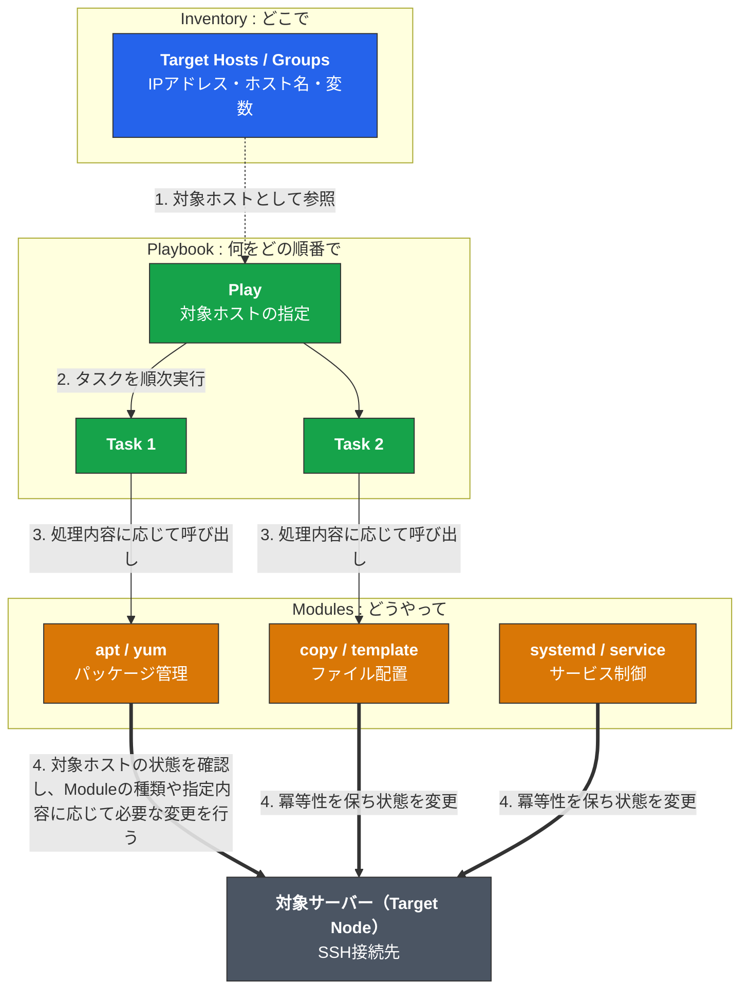

| 要素 | 役割 | 概念（たとえ） | 主な内容・書式 |
| :--- | :--- | :--- | :--- |
| **Inventory** | **操作対象**の定義 | 「**どこで**」 | ターゲットとなるホスト名、IPアドレス、グループ分け、接続変数の設定（YAML / INI形式） |
| **Playbook** | **実行手順**の構成 | 「**何を・どの順番で**」 | どのInventoryグループに対して、どのTask（Moduleの呼び出し）を順に適用するかを記述（YAML形式） |
| **Module** | **具体的処理**の実行単位 | 「**どうやって**」 | OSやミドルウェアを直接操作する最小機能（パッケージ管理、ファイル作成、サービス起動など） |
| **Variables** | **値**の受け渡し | 「**どんな値で**」 | `inventory_hostname`のようなAnsibleの自動変数、Inventoryやplaybookの`vars:`で指定する変数（15.5で扱う） |

以降の章では、この「Inventory→Playbook→Module」の順に沿って解説する（12章 Inventory→14章 Playbook）。ただし13章では、Playbookを書く前にInventoryが正しく使えるかをModule（`ansible.builtin.ping`）で疎通確認する。これは実務上、Playbookを書く前に接続確認を済ませておくのが定石だからであり、上の概念的な順序とは前後する点に注意する。

Ansibleを実行する側・される側は、それぞれ次のように呼ぶ。

| 用語 | 今回の対応 |
| --- | --- |
| Controller | Ansibleを実行するMac |
| Managed Node | Ansibleから操作される`ubuntu1` / `ubuntu2` |

## 11.2 Ansible実行シーケンス

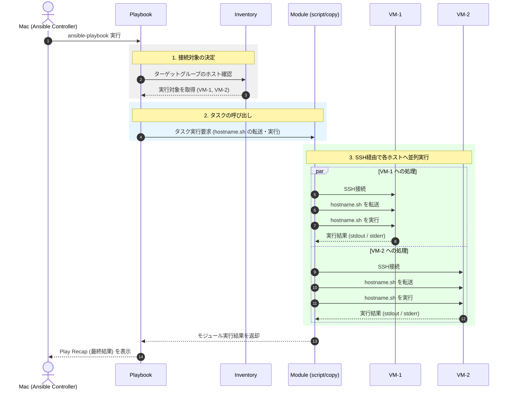


# 12. Inventory.ini解説

## 12.1 Inventoryとは

Inventoryは、Ansibleが管理するサーバーの一覧である。003（7.5 inventory.ini.tpl）で生成される実際のinventory.iniは、次の形式になる。

```ini
[ubuntu]
ubuntu1 ansible_host=192.168.64.10
ubuntu2 ansible_host=192.168.64.11

[ubuntu:vars]
ansible_user=ansible
ansible_ssh_private_key_file=~/.ssh/ansible/id_ed25519
ansible_python_interpreter=/usr/bin/python3
```

## 12.2 グループ

```ini
[ubuntu]
```

`ubuntu`というグループを定義している。

このグループには、

```text
ubuntu1
ubuntu2
```

が所属する。

## 12.3 `ansible_host`

```ini
ubuntu1 ansible_host=192.168.64.10
```

`ubuntu1`はAnsible上で使用するホスト名である。

実際にSSH接続するIPアドレスは、

```text
192.168.64.10
```

である。

つまり、

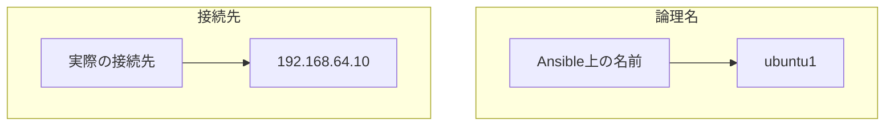

となる。

なお、`ansible_host`と同じ書き方で、ホストごとに任意の変数を追加することもできる。例えば、

```ini
ubuntu1 ansible_host=192.168.64.10 role=web
ubuntu2 ansible_host=192.168.64.11 role=db
```

のように`role`という変数を追加すると、`ubuntu1`と`ubuntu2`でそれぞれ異なる値（`web` / `db`）を持たせられる。これはAnsibleが自動的に決める値ではなく、**Mac上の`inventory.ini`で人間が明示的に指定する値**である（15.5で`template` moduleを使って実際に確認する）。

## 12.4 `[ubuntu:vars]`

```ini
[ubuntu:vars]
ansible_user=ansible
ansible_ssh_private_key_file=~/.ssh/ansible/id_ed25519
ansible_python_interpreter=/usr/bin/python3
```

`[ubuntu:vars]`は、`ubuntu`グループに所属する全ホストへ適用される変数を定義するセクションである。

- `ansible_user` はSSH接続時のログインユーザー（cloud-initで作成した`ansible`ユーザー）
- `ansible_ssh_private_key_file` はSSH接続に使う秘密鍵のパス（4.2で作成したもの）
- `ansible_python_interpreter` は対象VM上のPythonの場所

これらが指定されていないと、Ansibleは接続ユーザーや秘密鍵を特定できず、13章の接続確認が失敗する。

---

# 13. Ansible接続確認

AnsibleからVMへ接続できるか確認する。

```bash
cd ansible
```

このリポジトリには`ansible.cfg`を用意していないため、初回接続時にSSHのホスト鍵確認プロンプト（`Are you sure you want to continue connecting (yes/no/[fingerprint])?`）が表示されることがある。その場合は`yes`と入力する。

次に、

```bash
ansible all -i inventory.ini -m ansible.builtin.ping
```

を実行する。

成功すると、

```text
ubuntu1 | SUCCESS => {
    "changed": false,
    "ping": "pong"
}

ubuntu2 | SUCCESS => {
    "changed": false,
    "ping": "pong"
}
```

のような結果になる。

## 13.1 `ansible.builtin.ping`とは

ここでの`ansible.builtin.ping`は、ICMPのpingとは異なる。

Ansibleの`ansible.builtin.ping` moduleは、

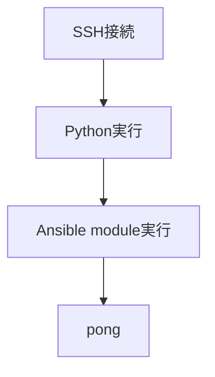

という流れで、Ansibleから対象ホストを操作できるか確認する。

---

# 14. Playbook解説

## 14.1 Playbookとは

Playbookは、Ansibleに実行させる処理をYAML形式で定義したファイルである。

今回のファイルは、

```text
ansible/run_script.yml
```

とする。

## 14.2 Shellスクリプト

まずMac上にShellスクリプトを作成する。

```bash
mkdir -p scripts
```

`hostname.sh`：

```bash
#!/bin/bash

echo "hostname: $(hostname)"
echo "date: $(date)"
```

実行権限を付与する。

```bash
chmod +x scripts/hostname.sh
```

---

# 15. Mac上のShellをリモート実行する

## 15.1 `script` module

Ansibleには`script` moduleがある。

このmoduleを使用すると、Ansibleを実行しているMac上のスクリプトを対象ホストへ転送して実行できる。

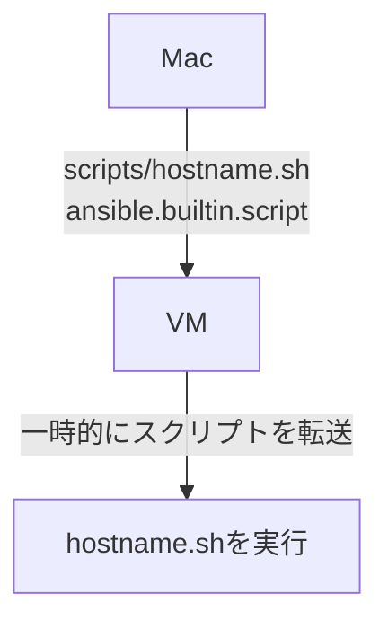

## 15.2 Playbook

`ansible/run_script.yml`：

```yaml
---
- name: Sample script to run local shell on remote hosts
  hosts: all
  gather_facts: false

  tasks:
    - name: Execute shell on remote hosts
      ansible.builtin.script: ./scripts/hostname.sh
      register: result

    - name: Show result
      ansible.builtin.debug:
        var: result.stdout_lines
```

## 15.3 `hosts`

```yaml
hosts: all
```

`all`は、Inventoryに登録されているすべてのホストを対象にする特別な指定である。グループ名（`[ubuntu]`など）を指定していないため、

```text
inventory.ini
 ├─ ubuntu1
 └─ ubuntu2
```

の2台が対象になる。特定のグループだけを対象にしたい場合は、`hosts: ubuntu`のようにグループ名を指定する。

## 15.4 `ansible.builtin.script`

```yaml
ansible.builtin.script: ./scripts/hostname.sh
```

Mac上に存在するShellスクリプトを対象VMへ転送して実行する。`cmd:`キーを使わず、モジュール名の直後にパスを書く短縮記法である。

重要なのは、

```text
./scripts/hostname.sh
```

のパスは**Ansibleを実行するMac側から見たパス**だという点である。`ansible-playbook`を`ansible`ディレクトリから実行するため、このパスは`ansible/scripts/hostname.sh`を指す。

VM側に、

```text
./scripts/hostname.sh
```

というファイルが最初から存在している必要はない。

`register: result`で実行結果を変数に格納し、続く`ansible.builtin.debug`タスクで`result.stdout_lines`（スクリプトの標準出力）を表示する。

## 15.5 `template` moduleで変数をVMごとに出し分ける

### 15.5.1 `template` moduleとは

`script`や`copy`がファイルをそのまま転送するのに対し、`template` moduleはMac上のJinja2テンプレート（`.j2`ファイル）を対象VMへ転送する前に、テンプレート内の`{{ }}`部分を実際の値に置き換える。

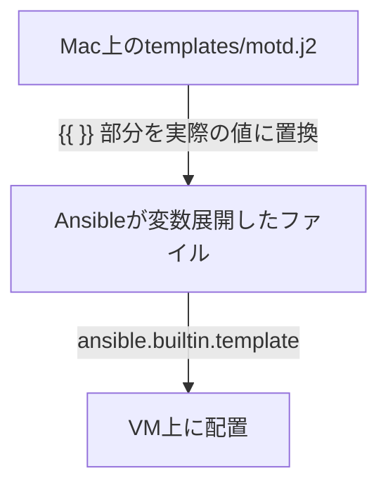

ここで使う変数は、次の2種類に分けられる。

| 変数 | 由来 | VMごとの値 |
| --- | --- | --- |
| `inventory_hostname` | Ansibleが自動的に持つ組み込み変数 | Inventory上のホスト名がそのまま入る（`ubuntu1`なら`ubuntu1`） |
| `role` | Mac上の`inventory.ini`で人間が明示的に指定する変数（12.3） | ホストごとに自由な値を設定できる（`ubuntu1`は`web`、`ubuntu2`は`db`など） |

### 15.5.2 テンプレートファイル

まずMac上にテンプレートを作成する。

```bash
mkdir -p templates
```

`templates/motd.j2`：

```jinja2
inventory_hostname (自動変数): {{ inventory_hostname }}
role (Mac側でホスト毎に指定): {{ role }}
```

### 15.5.3 Inventoryにホスト毎の変数を追加

12.3で触れたとおり、`ansible_host`と同じ書き方で`inventory.ini`に`role`を追加する。

```ini
[ubuntu]
ubuntu1 ansible_host=192.168.64.10 role=web
ubuntu2 ansible_host=192.168.64.11 role=db
```

### 15.5.4 Playbook

`run_script.yml`（14〜15章のサンプル）とは別に、`run_template.yml`という新しいPlaybookを作成する。

```text
ansible/run_template.yml
```

```yaml
---
- name: Sample template to render per-host values
  hosts: all
  gather_facts: false

  tasks:
    - name: Deploy MOTD from template
      ansible.builtin.template:
        src: templates/motd.j2
        dest: /tmp/motd.txt
        mode: "0644"
```

`src:`にMac上のテンプレートのパス、`dest:`にVM上の出力先パスを指定する。`mode:`はVM上に作成するファイルのパーミッションを明示する指定であり、省略すると`ansible-lint`の`risky-file-permissions`ルールに引っかかるため明記している。

Playbookを`run_script.yml`に追記せず、`run_template.yml`として分けているのには理由がある。この`template`タスクは`inventory.ini`に`role`が定義されていることを前提にしており、15.5.3の手順を済ませる前は`role`が未定義でエラーになる。もし`run_script.yml`に追記していると、16章で最初に`run_script.yml`を実行する時点（`role`未定義の段階）で失敗してしまう。Playbookを分けることで、既存の`script`サンプル（16章）はそのまま動かしつつ、`template`サンプルは15.5.3を済ませた後に任意のタイミングで試せるようにしている。

### 15.5.5 実行

```bash
cd ansible

ansible-playbook \
  -i inventory.ini \
  run_template.yml
```

`role`が未定義のまま実行すると、次のようなエラーになる。

```text
'role' is undefined
Origin: templates/motd.j2

ubuntu1 | FAILED! => {
    "changed": false,
    "msg": "Task failed: 'role' is undefined"
}
```

`inventory_hostname`はAnsibleが自動的に持つ変数のため常に解決できるが、`role`は`inventory.ini`（15.5.3）で明示的に定義しない限り値を持たない。このエラーは、「Ansibleが自動で埋める変数」と「Mac側で人間が指定する変数」の違いを体感する良い例である。

### 15.5.6 実行結果の確認

Playbook実行後、各VMの`/tmp/motd.txt`を確認する。

```bash
ansible all -i inventory.ini -m ansible.builtin.fetch \
  -a "src=/tmp/motd.txt dest=/tmp/motd_check/ flat=no"
```

もしくは直接SSHして中身を見ると、`ubuntu1`では、

```text
inventory_hostname (自動変数): ubuntu1
role (Mac側でホスト毎に指定): web
```

`ubuntu2`では、

```text
inventory_hostname (自動変数): ubuntu2
role (Mac側でホスト毎に指定): db
```

のように、同じテンプレートから**ホストごとに異なる内容のファイル**が生成されていることが確認できる。`inventory_hostname`はAnsibleが自動で埋めた値、`role`はMac上の`inventory.ini`で人間が指定した値であり、両者は由来が異なる点に注意する。

---

# 16. Ansible実行コマンド

## 16.1 Playbookを実行

```bash
cd ansible

ansible-playbook \
  -i inventory.ini \
  run_script.yml
```

## 16.2 実行イメージ

11.2で示したAnsibleの一般的な処理シーケンスを、今回のPlaybook（`run_script.yml`）の実行結果に当てはめると次のようになる。

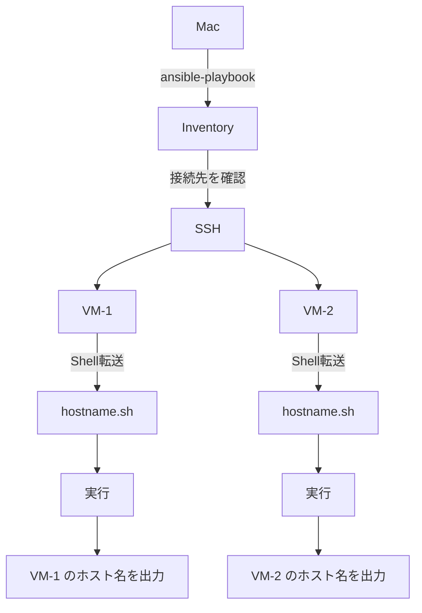

## 16.3 実行結果

例えば、

```text
TASK [Execute shell on remote hosts] ******************************

changed: [ubuntu1]
changed: [ubuntu2]

TASK [Show result] **************************************************

ok: [ubuntu1] => {
    "result.stdout_lines": [
        "hostname: ubuntu1",
        "date: ..."
    ]
}
ok: [ubuntu2] => {
    "result.stdout_lines": [
        "hostname: ubuntu2",
        "date: ..."
    ]
}
```

のようになる。`run_script.yml`の`Show result`タスク（15.2）により、`ansible.builtin.debug`が`hostname.sh`の標準出力（`stdout_lines`）をそのまま表示する。

---

# 17. `script` moduleと`command` / `shell` / `template`の違い

Ansibleでは、コマンド実行に複数のmoduleがある。

| Module | 特徴 |
| --- | --- |
| `command` | リモートでコマンドを実行 |
| `shell` | リモートでShellを実行 |
| `script` | ローカルのスクリプトをリモートへ転送して実行 |
| `template` | ローカルのJinja2テンプレートを変数展開してからリモートへ配置（15.5） |

例えば、

```yaml
ansible.builtin.command:
  cmd: hostname
```

の場合、

```text
VM上でhostnameを実行
```

する。

一方、

```yaml
ansible.builtin.script:
  cmd: scripts/hostname.sh
```

の場合、

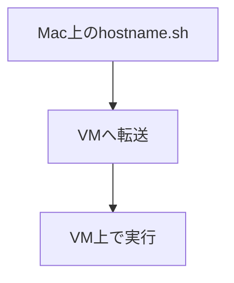

となる。

今回の勉強会では、この違いを理解することが重要である。

## 17.1 Ansibleは「SSHでコマンドを投げるだけのツール」ではない

`command`/`shell`/`script`だけを見ると、AnsibleはSSH経由でコマンドを実行するツールに見えるかもしれない。しかし、Ansibleの本質は「サーバーを目的の状態にすること」であり、`apt`（パッケージ導入）・`copy`/`template`（ファイル配置）・`service`（サービス起動）など、状態を宣言的に指定するためのModuleが数多く用意されている。


`command`/`shell`/`script`はいずれも「手続き（何をするか）」を書くModuleだが、`apt`や`service`のような多くのModuleは「状態（どうあるべきか）」を書くという発想になっている。この違いは22章の演習で実際に確認する。

---

# 18. Ansibleの処理を整理する

ここまでの処理をまとめる。Terraformによる基盤構築（003）からAnsibleによるShell実行（本章まで）までの一連の流れは、次のようになる。

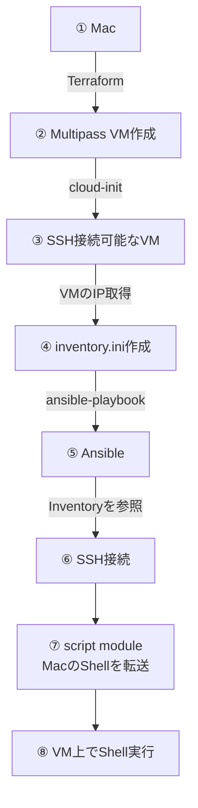

---

# 19. Ansible接続のトラブルシューティング

ここでは、Ansible特有のトラブルシューティングを扱う。Multipass自体の起動確認・VMログイン確認や`terraform apply`固有の問題は「003 10. トラブルシューティング」を参照。

## 19.1 Inventoryの接続情報を確認

Inventoryを確認する。

```bash
cat ansible/inventory.ini
```

さらにAnsibleがどのような接続情報を認識しているか確認できる。

```bash
ansible-inventory \
  -i ansible/inventory.ini \
  --list
```

## 19.2 Ansible ping

SSH接続ができるか、Ansibleから確認する（13章と同じコマンドである）。

```bash
ansible all \
  -i ansible/inventory.ini \
  -m ansible.builtin.ping
```

成功：

```text
SUCCESS
```

失敗：

```text
UNREACHABLE
```

などになる。`UNREACHABLE`の場合は、Inventoryの接続情報（19.1）やSSH鍵のパス（002 4.2 / 004 12.4の`[ubuntu:vars]`）を疑う。

---

# 20. 「どこが悪いのか」を切り分ける

## 20.1 レイヤー構成

今回の環境では、問題を次の4層に分けて考えると分かりやすい。

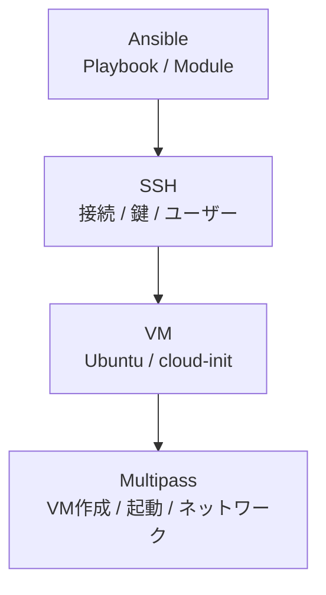

切り分けの際には下位のレイヤーから順に確認する。

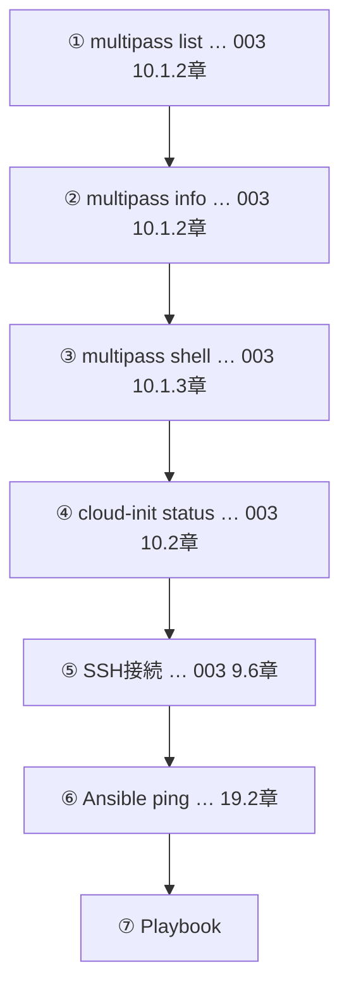

いきなりAnsible Playbookを調査するのではなく、下位のレイヤーから確認する。

## 20.2 切り分けの考え方

例えば、

```text
multipass list
```

が失敗するなら、Ansibleを調べる必要はない。

一方、

```text
multipass list
```

は正常で、

```text
multipass shell
```

も正常、

```text
ssh ansible@IP
```

も正常なのに、

```text
ansible ... -m ansible.builtin.ping
```

が失敗する場合は、Inventoryや`ansible_ssh_private_key_file`などのSSH設定を疑う。

---

# 21. トラブルシューティング早見表

20章のレイヤー構成・切り分けの考え方を、症状別の早見表として要約したものである。

| 症状 | 最初に確認するもの |
| --- | --- |
| `multipass`コマンド自体が動かない | Multipass（003 10.1.1） |
| VMが存在しない | `multipass list`（003 10.1.2） |
| VMが停止している | `multipass start` |
| IPアドレスがない | `multipass info` / VM状態（003 10.1.2） |
| VMには入れるがcloud-initが終わらない | `cloud-init status` / ログ（003 10.2） |
| SSHできない | IP・SSH鍵・ユーザー（003 9.6） |
| SSHできるがAnsible ping失敗 | Inventory・Ansible設定（19章） |
| Ansible pingは成功するがPlaybook失敗 | Playbook・Module |
| Shellが実行できない | Shellの内容・権限・改行コード |
| VMが中途半端な状態で残っている | `multipass delete --purge` → `terraform apply`（003 10.3） |

---

# 22. 演習問題

## 演習1：VMを1台追加する

Terraformの設定（`terraform.tfvars`の`nodes`）を変更して、

```text
ubuntu1
ubuntu2
ubuntu3
```

の3台構成にする。

## 演習2：Shellを変更する

`hostname.sh`を変更して、以下の情報を表示する。

- ホスト名
- OS情報
- IPアドレス
- 現在時刻

## 演習3：Ansibleの対象を変更する

Inventoryに、

```ini
[ubuntu]
ubuntu1
ubuntu2

[server1]
ubuntu1

[server2]
ubuntu2
```

のようなグループを追加し、Playbookの`hosts: all`を`hosts: server1`に変更して`server1`だけを対象にする。

## 演習4：`copy` moduleで冪等性を確認する

`/tmp/workshop.txt`を2台のVMに作成するPlaybookを自分で作成する。

条件：

- 新しいPlaybook（例：`run_copy.yml`）を作成する
- `ansible.builtin.copy`を使用する
- 2台とも同じ内容のファイルを作成する
- 同じPlaybookを2回実行し、1回目は`changed`、2回目は`changed=0`（`ok`）になることを確認する

15章で扱った`script`は実行するたびに`changed`になる（`creates`を指定しない限り冪等ではない）。`copy`は「指定した内容のファイルが既にあるかどうか」を判定するため、2回目は変更なしと判断される。この違いを実際に手を動かして確認する。

## 演習5：わざと失敗させる

Inventoryの`ansible_host`を実在しないIPアドレス（例：`192.168.64.250`）に書き換えてから、13章の`ansible.builtin.ping`を実行する。

```text
UNREACHABLE
```

になることを確認したうえで、正しいIPアドレスに戻して`ping`が`SUCCESS`に戻ることを確認する。「失敗する→原因を切り分ける（19〜21章）→修正する→再実行する」という一連の流れを体験することが目的である。

## 演習6：任意の最終課題

余裕があれば、以下にも挑戦する。

- 演習1のVM3台構成を維持したまま、15.5の`template`サンプル（`role`変数）を`ubuntu3`にも対応させる
- `terraform destroy` → `terraform apply` → Ansible再実行を行い、同じ結果が再現できることを確認する（9.5参照）

---

[← 前へ：003：TerraformによるVM構築とトラブルシューティング](003_terraform_ansible_workshop.md) | [目次](001_terraform_ansible_workshop.md#目次) | [次へ：005：全体まとめと自動化検証の基本パターン →](005_terraform_ansible_workshop.md)
