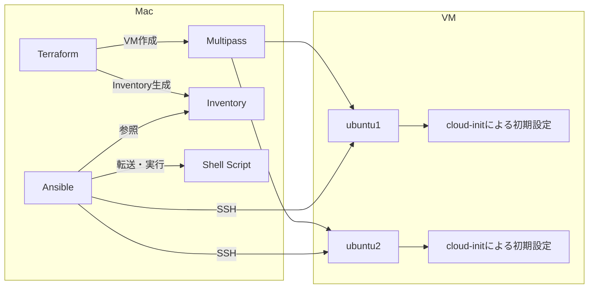
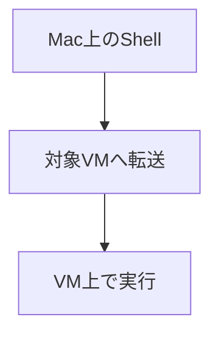
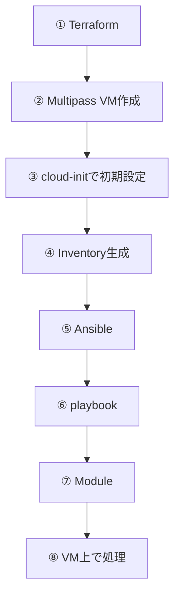
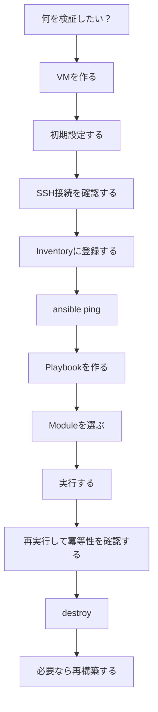

# 23. 最終的な完成形

今回構築した環境を最終的に整理すると、次のようになる。



---

# 24. この勉強会で覚えてほしいこと

最後に、今回の勉強会で特に覚えてほしいポイントを整理する。

## Point 1：Multipass

```text
Mac上でUbuntu VMを動かす
```

## Point 2：Terraform

```text
VMをコードから作成・管理する
```

## Point 3：cloud-init

```text
VMの初回起動時に初期設定する
```

## Point 4：Inventory

```text
Ansibleが「どのサーバーを操作するか」を定義する
```

## Point 5：Playbook

```text
Ansibleが「何をするか」を定義する
```

## Point 6：script module



## Point 7：トラブルシューティング

```text
問題が起きたら、下位のレイヤーから順番に切り分ける。
```

「Ansibleが動かない」と一括りにせず、**どの層で問題が発生しているのかを切り分けること**が重要である。

---

# 25. まとめ

今回の構成では、複数のツールを組み合わせてサーバー環境を構築した。



重要なのは、各ツールを単独で覚えることではない。

```text
「誰が」
「何を」
「どのタイミングで」
「どこに対して」
実行するのか
```

を意識すると、Terraform・cloud-init・Ansibleを組み合わせた構成でも処理の流れを追いやすくなる。

---

# 26. 自動化検証の基本パターン

今回の勉強会を通じて体験した一連の流れを、汎用的な「型」として整理すると次のようになる。何かを自動化して検証したくなったとき、この型に沿って考えると迷いにくい。



「TerraformとAnsibleの使い方を知っている」状態がゴールではなく、

> 検証したいことがあれば、自分でVMを用意し、Ansibleで自動化して検証できる

状態になることが、この勉強会の最終的な到達目標である。

---

[← 前へ：004：Ansibleの実行・Playbook解説・演習問題](004_terraform_ansible_workshop.md) | [目次](001_terraform_ansible_workshop.md#目次)
