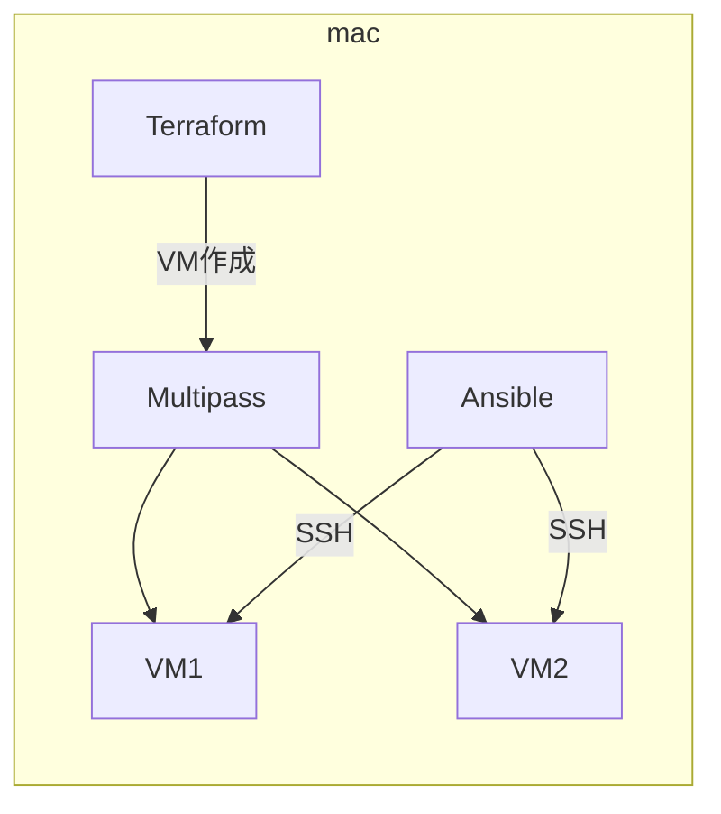
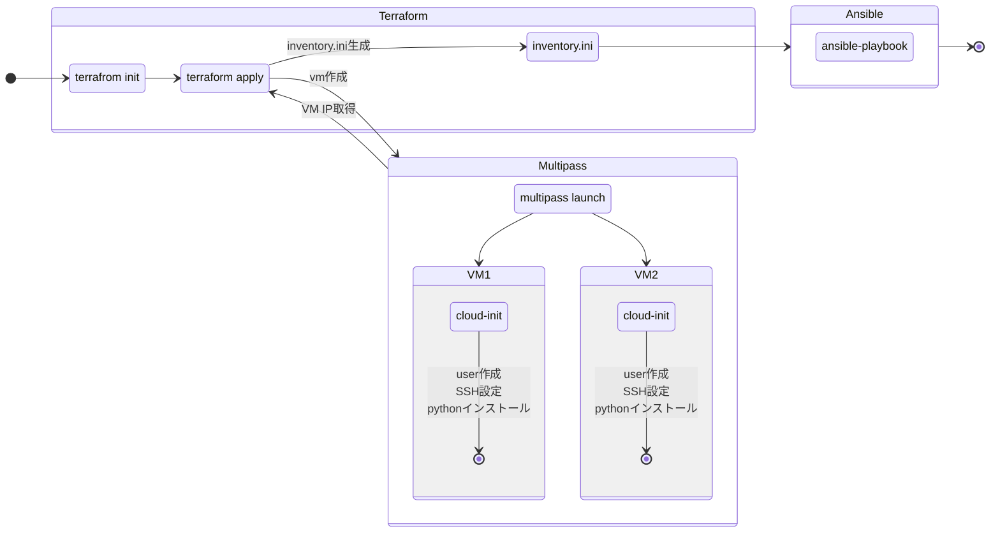
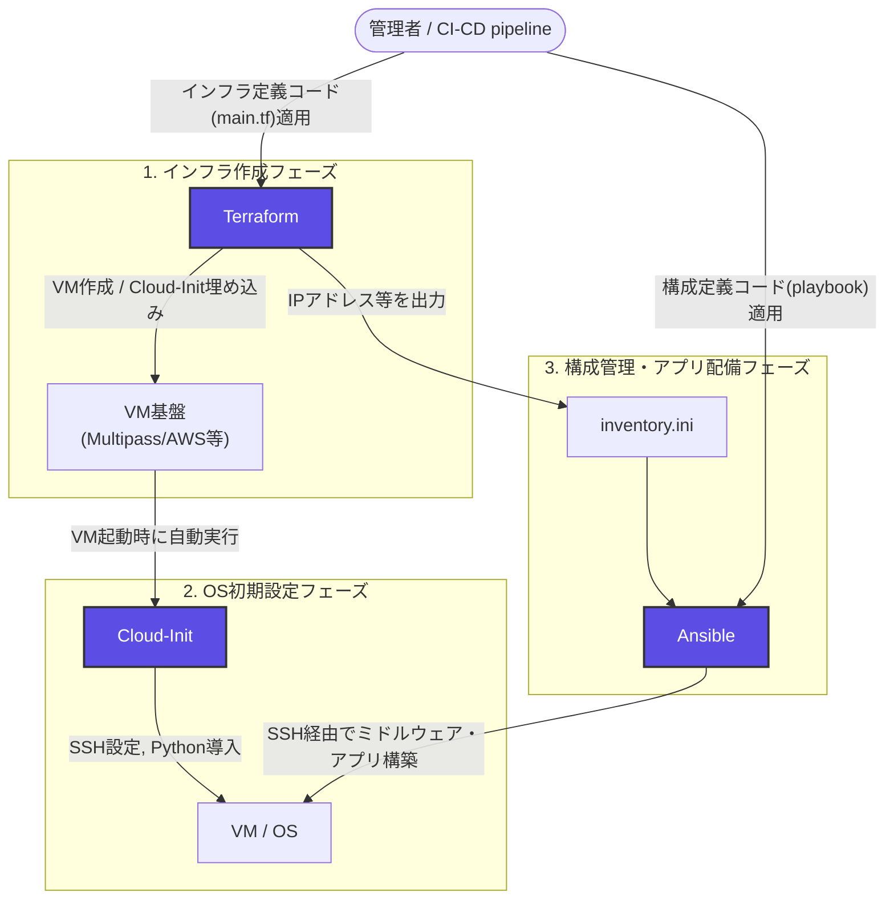
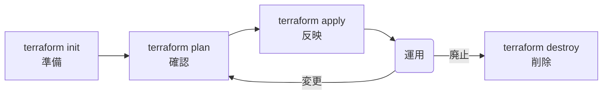

# Ansible勉強会

## Terraformで構築したMultipass VMへMacのShellをリモート実行する

---

# 1. はじめに

## 1.1 この勉強会の目的

この勉強会では、Mac上に2台のUbuntu VMを構築し、Ansibleからリモート操作するまでの一連の流れを学習する。

VMの作成にはTerraform、VMの初期設定にはcloud-init、VMに対する構築・設定・処理にはAnsibleを使用する。

最終的には、Mac上にあるShellスクリプトをAnsibleからVMへ転送し、リモートで実行する。

```text
Mac
 │
 ├─ Terraform
 │    └─ Multipass VMを2台作成
 │
 ├─ cloud-init
 │    └─ VMの初期設定
 │
 └─ Ansible
      ├─ Inventoryで対象VMを指定
      ├─ SSHでVMへ接続
      └─ Mac上のShellをVMへ転送して実行
```

## 1.2 この勉強会で理解すること

この勉強会では、次の内容を理解することを目標とする。

- Multipassとは何か
- TerraformからMultipass VMを作成する方法
- cloud-initの役割
- Terraform・cloud-init・Ansibleの役割分担
- Ansible Inventoryとは何か
- Ansible Playbookとは何か
- Ansibleからリモートサーバーを操作する方法
- Mac上のShellスクリプトをAnsibleから実行する方法
- Multipassで問題が発生した場合の確認方法

---

# 2. 論理構成

## 2.1 全体構成



## 2.2 全体の流れ



## 2.3 使用するツール

| ツール | 役割 |
| --- | --- |
| Terraform | VM作成などのインフラ構築をコード化する |
| cloud-init | VM作成時の初期設定を行う |
| Ansible | VMへの設定・処理を自動化する |
| Multipass | Ubuntu VMをMac上で動作させる |

---

# 3. Terraform・cloud-init・Ansibleの役割分担



## 3.1 3つのツールの関係

| ツール | 役割・分類 | 担当レイヤー | 主な実行タイミング | 主な作業内容 |
| :--- | :--- | :--- | :--- | :--- |
| **Terraform** | インフラプロビジョニング | 外枠（クラウド / 物理インフラ） | API経由で事前実行 | VM作成、ネットワーク構築、`cloud-init` 設定（`user_data`）の注入 |
| **cloud-init** | OSブートストラップ（初期化） | OS土台（初回起動処理） | VMの初回ブート時 | ユーザー・SSH鍵設定、ネットワーク構成、Python導入など最小限の環境整備 |
| **Ansible** | 構成管理・自動化 | 中身（OS内部 / ミドルウェア） | OS起動・初期化完了後 | ミドルウェア（Nginx, Docker等）の導入、設定ファイル配布、アプリ構築 |

## 3.2 Terraform単体でも可能な作業をあえて役割分担すべき理由

Terraformは `remote-exec` プロビジョナーや `user_data` を使用することで、OS内部の設定まで完結させることが可能である。しかし、実務においては**「Terraform = 外枠」「cloud-init / Ansible = 中身」**と明確に役割を分離して運用するのがベストプラクティスとされる。

### 宣言型と手続型の違いによるメンテナンス性
* **Terraformの限界:** インフラ全体の「あるべき姿（宣言型）」の管理には適しているが、OS内部で一連のコマンドを順番に実行するような「手順（手続型）」の処理を管理する設計にはなっていない。
* **Ansibleの強み:** ベストプラクティスに基づいたモジュール（`apt`、`service`、`template`など）が豊富であり、OS内部の設定変更やサービス起動処理を安全かつ簡潔に記述できる。

### 状態管理（tfstate）の肥大化とリスクの回避
* **Terraformの仕組み:** すべてのコンポーネントの状態（tfstate）を追跡する仕組みを持つ。アプリの設定やミドルウェアの変更までTerraformで管理すると、`terraform plan` や `apply` の実行時間が極端に長くなる。
* **リスク分散:** インフラ層とOS/アプリ層を切り離すことで、OS内部の軽微な設定変更のたびにTerraformを実行し、基盤全体へ影響を与えるリスク（誤ってVMを再作成してしまう等）を回避できる。

### 実行時の冪等性（Idempotency）と安全性の確保
* **プロビジョナーの脆弱性:** Terraformの `remote-exec` 等は「コマンドの実行」を行うのみであり、失敗時のリカバリや「設定済みの場合のスキップ」といった高度な冪等性の確保が困難である。
* **Ansibleの強み:** 何度実行しても同じ正しい状態に収束するように設計されており、エラー発生時のハンドリングやドライラン（`--check`）も安全に行うことができる。

### 再利用性と責務の分離（チーム運用）
* **責務の明確化:** 「インフラチーム（クラウド基盤管理）」と「App/SREチーム（OS・ミドルウェア管理）」でコードベースや作業権限を分離できる。
* **再利用性:** AnsibleのプレイブックやRoleを共通化しておけば、クラウド環境（AWS, GCP, オンプレミス）が変更された場合でも、Terraform側のみを差し替えることで同一のOS設定を再利用できる。

## 3.3 まとめ（選定指針）

| 方式 | 特徴・適した用途 |
| :--- | :--- |
| **Terraform単体** | 検証環境や、Golden Image（AMI等）を作成するのみの単純な構成 |
| **Terraform + cloud-init** | コンテナホスト等、OS起動時に最小限の初期化（Docker導入等）で完結する場合 |
| **Terraform + Ansible (+ cloud-init)** | 複雑なミドルウェア構成、既存OS設定の継続的変更が必要な本番環境 |

---

# 4. 事前準備

## 4.1 必要なソフトウェア

Macに以下のソフトウェアをインストールする。

```text
Mac
 │
 ├─ Multipass
 ├─ Terraform
 └─ Ansible
```

### 4.1.1 Multipass

#### Multipassとは

Multipassは、Ubuntu VMを簡単に作成・管理するためのツールである。

```text
Mac
 │
 └─ Multipass
      ├─ ansible-vm-1
      └─ ansible-vm-2
```

#### インストール

[Install Multipass](https://canonical.com/multipass/install)

### 4.1.2 Terraform

#### Terraformとは

Terraformは、インフラストラクチャをコードで管理するためのツールである。

例えば、

```text
「Ubuntu VMを2台作成する」
```

という作業をTerraformの設定ファイルとして記述できる。

```text
Terraform
    │
    │ terraform apply
    ▼
Multipass
    │
    ├─ VM-1
    └─ VM-2
```

#### インストール

[Install Terraform](/aws-get-started/install-cli)


### 4.1.3 Ansible

### Ansibleとは

Ansibleは、サーバーの設定やコマンド実行などを自動化するためのツールである。
Ansible自身が管理対象VM上にインストールされている必要はない。

```text
Mac
 │
 │ Ansible
 │
 ├──SSH──> VM-1
 │
 └──SSH──> VM-2
```

### インストール

[Install Ansible](https://docs.ansible.com/projects/ansible/latest/installation_guide/intro_installation.html#installing-and-upgrading-ansible-with-pipx)


## 4.2 SSH鍵の準備

AnsibleはSSHを使用してVMへ接続するため、Ansible用SSH鍵を作成する。
※ 既存のSSH鍵の使用も可

```shell
mkdir -p ~/.ssh/ansible/
ssh-keygen -t ed25519 -f ~/.ssh/ansible/id_ed25519 -N ""
```

SSH鍵が存在するか確認する。

```bash
ls ~/.ssh/ansible/
```

以下のファイルが存在することを確認する。

```text
~/.ssh/ansible/id_ed25519
~/.ssh/ansible/id_ed25519.pub
```

公開鍵を確認する。

```bash
cat ~/.ssh/id_ed25519.pub
```

この公開鍵をcloud-initからVMへ登録する。

# 5. Multipass概要

## 5.1 Multipassの基本操作

Multipassでは、CLIからVMを操作できる。

| コマンド | 内容 |
| --- | --- |
| `multipass launch` | VMを作成・起動 |
| `multipass start` | VMを起動 |
| `multipass stop` | VMを停止 |
| `multipass restart` | VMを再起動 |
| `multipass delete` | VMを削除対象にする |
| `multipass purge` | 削除対象VMを完全削除 |
| `multipass list` | VM一覧を表示 |
| `multipass info` | VMの詳細を表示 |
| `multipass shell` | VMへログイン |

## 5.2 VMを起動する

### ubuntu 24.04の起動から削除までの流れ

```bash
$ multipass launch 24.04 --name test-vm --cpus 1 --memory 2G --disk 8G  # VM起動
Launched: test-vm

$ multipass list  # VM確認
Name                    State             IPv4             Image
test-vm                 Running           192.168.252.xx   Ubuntu 24.04 LTS

$ multipass delete test-vm --purge  # VM削除

$ multipass list  # VM確認
No instances found.
```

Ansibleでは、`multipass list`のIPv4を使用してVMへSSH接続する。

# 6. VM構築

ここからTerraformを使用してVMを構築する。

## 6.1 ディレクトリ構成

今回のサンプルでは、以下の構成とする。

```text
.
├── ansible
│   ├── run_script.yml
│   └── scripts
│       └── hostname.sh
└── terraform
    ├── cloud-init.yaml.tftpl
    ├── inventory.ini.tpl
    ├── main.tf
    ├── terraform.tfvars
    └── variables.tf
```

役割は次のとおりである。

| ファイル | 役割 |
| --- | --- |
| `terraform/main.tf` | Multipass VMをTerraformから作成 |
| `terraform/cloud-init/user-data.yaml` | VM初期設定 |
| `ansible/inventory.ini` | Ansibleの接続先 |
| `ansible/site.yml` | Ansibleの処理内容 |
| `scripts/hello.sh` | MacからVMへ転送して実行するShell |

# 7. Terraform 解説

## 7.1 Terraformの役割

Terraformが担当するのは、主にVMのライフサイクルである。



## 7.2 main.tf

```hcl
terraform {
  required_version = ">= 1.6.0"

  required_providers {
    multipass = {
      source  = "todoroff/multipass"
      version = "~> 1.7"
    }
  }
}

locals {
  ssh_public_key = trimspace(
    file(pathexpand(var.ssh_public_key_path))
  )
}

resource "multipass_instance" "node" {
  for_each = var.nodes

  name   = each.key
  image  = var.vm_image
  cpus   = each.value.cpus
  memory = each.value.memory
  disk   = each.value.disk

  cloud_init = templatefile(
    "${path.module}/cloud-init.yaml.tftpl",
    {
      ssh_public_key = local.ssh_public_key
    }
  )
}

resource "local_file" "ansible_inventory" {
  filename = "${path.module}/${var.ansible_inventory_path}"

  content = templatefile(
    "${path.module}/inventory.ini.tpl",
    {
      nodes = {
        for name, node in multipass_instance.node :
        name => node.ipv4[0]
      }

      ssh_private_key_path = var.ssh_private_key_path
    }
  )
}

output "nodes" {
  value = {
    for name, node in multipass_instance.node :
    name => {
      ipv4  = node.ipv4
      state = node.state
    }
  }
}

output "inventory_file" {
  value = local_file.ansible_inventory.filename
}
```

# 8. cloud-init概要

## 8.1 cloud-initとは

cloud-initは、VMやクラウドインスタンスの初回起動時に初期設定を行う仕組みである。

例えば、

- ユーザー作成
- SSH公開鍵登録
- パッケージインストール
- ファイル作成
- 初期設定

などを自動化できる。

## 8.2 cloud-init.yaml

```yaml
#cloud-config

users:
  - default

  - name: ansible
    gecos: Ansible user
    shell: /bin/bash
    groups:
      - sudo
    sudo:
      - ALL=(ALL) NOPASSWD:ALL
    lock_passwd: true
    ssh_authorized_keys:
      - ${ssh_public_key}

ssh_pwauth: false
disable_root: true

packages:
  - python3
  - python3-apt
```

実際には、

```yaml
YOUR_SSH_PUBLIC_KEY
```

をMacの公開鍵に置き換える。

例えば、

```bash
cat ~/.ssh/id_ed25519.pub
```

で表示された内容を使用する。

# 10. VM構築の実行

## 10.1 Terraformディレクトリへ移動

```bash
cd terraform
```

## 10.2 Terraform初期化

```bash
terraform init
```

Terraformで使用する環境を初期化する。

## 10.3 実行計画を確認

```bash
terraform plan
```

どのような変更が行われるかを確認する。

## 10.4 VMを作成

```bash
terraform apply
```

確認を求められたら、

```text
yes
```

を入力する。

## 10.5 Multipassの状態確認

```bash
multipass list
```

以下のように2台のVMが表示されれば成功である。

```text
Name                    State             IPv4
ansible-vm-1            RUNNING           192.168.x.x
ansible-vm-2            RUNNING           192.168.x.x
```

## 10.6 Inventory確認

```bash
cat ../ansible/inventory.ini
```

例：

```ini
[servers]
ansible-vm-1 ansible_host=192.168.64.10
ansible-vm-2 ansible_host=192.168.64.11
```

これでAnsibleが接続する対象が決まる。

---

# 11. Ansible実行

## 11.1 Ansibleの基本構造

Ansibleでは、主に次の3つを理解する。

```text
Inventory
   │
   │ 「どこに接続するか」
   ▼
Playbook
   │
   │ 「何をするか」
   ▼
Module
   │
   │ 「どのように実行するか」
   ▼
対象VM
```

---

# 12. Ansible実行シーケンス

```text
Mac
 │
 │ ansible-playbook
 ▼
Inventory
 │
 │ 接続先を確認
 ▼
SSH
 │
 ├───────────────┐
 ▼               ▼
VM-1             VM-2
 │               │
 │ Shell転送     │ Shell転送
 ▼               ▼
hello.sh         hello.sh
 │               │
 ▼               ▼
実行             実行
```

---

# 13. Inventory.ini解説

## 13.1 Inventoryとは

Inventoryは、Ansibleが管理するサーバーの一覧である。

```ini
[servers]
ansible-vm-1 ansible_host=192.168.64.10
ansible-vm-2 ansible_host=192.168.64.11
```

## 13.2 グループ

```ini
[servers]
```

`servers`というグループを定義している。

このグループには、

```text
ansible-vm-1
ansible-vm-2
```

が所属する。

## 13.3 `ansible_host`

```ini
ansible-vm-1 ansible_host=192.168.64.10
```

`ansible-vm-1`はAnsible上で使用するホスト名である。

実際にSSH接続するIPアドレスは、

```text
192.168.64.10
```

である。

つまり、

```text
Ansible上の名前
    ↓
ansible-vm-1

実際の接続先
    ↓
192.168.64.10
```

となる。

---

# 14. Ansible接続確認

AnsibleからVMへ接続できるか確認する。

```bash
cd ansible
```

次に、

```bash
ansible all -i inventory.ini -m ping
```

を実行する。

成功すると、

```text
ansible-vm-1 | SUCCESS => {
    "changed": false,
    "ping": "pong"
}

ansible-vm-2 | SUCCESS => {
    "changed": false,
    "ping": "pong"
}
```

のような結果になる。

## 14.1 `ping`とは

ここでの`ping`は、ICMPのpingとは異なる。

Ansibleの`ping` moduleは、

```text
SSH接続
   ↓
Python実行
   ↓
Ansible module実行
   ↓
pong
```

という流れで、Ansibleから対象ホストを操作できるか確認する。

---

# 15. Playbook解説

## 15.1 Playbookとは

Playbookは、Ansibleに実行させる処理をYAML形式で定義したファイルである。

今回のファイルは、

```text
ansible/site.yml
```

とする。

## 15.2 Shellスクリプト

まずMac上にShellスクリプトを作成する。

```bash
mkdir -p scripts
```

`hello.sh`：

```bash
#!/bin/bash

echo "Hello from Ansible!"
echo "Hostname: $(hostname)"
echo "Date: $(date)"
```

実行権限を付与する。

```bash
chmod +x scripts/hello.sh
```

---

# 16. Mac上のShellをリモート実行する

## 16.1 `script` module

Ansibleには`script` moduleがある。

このmoduleを使用すると、Ansibleを実行しているMac上のスクリプトを対象ホストへ転送して実行できる。

```text
Mac
 │
 │ scripts/hello.sh
 │
 │ ansible.builtin.script
 ▼
VM
 │
 │ 一時的にスクリプトを転送
 ▼
hello.shを実行
```

## 16.2 Playbook

`ansible/site.yml`：

```yaml
---
- name: Execute local shell script on remote VMs
  hosts: servers
  become: false

  tasks:
    - name: Execute local shell script
      ansible.builtin.script:
        cmd: ../scripts/hello.sh
```

## 16.3 `hosts`

```yaml
hosts: servers
```

Inventoryの、

```ini
[servers]
```

グループを対象にする。

つまり、

```text
servers
 ├─ ansible-vm-1
 └─ ansible-vm-2
```

の2台が対象になる。

## 16.4 `ansible.builtin.script`

```yaml
ansible.builtin.script:
```

Mac上に存在するShellスクリプトを対象VMへ転送して実行する。

重要なのは、

```yaml
cmd: ../scripts/hello.sh
```

のパスは**Ansibleを実行するMac側から見たパス**だという点である。

VM側に、

```text
../scripts/hello.sh
```

というファイルが最初から存在している必要はない。

---

# 17. Ansible実行コマンド

## 17.1 Playbookを実行

```bash
cd ansible

ansible-playbook \
  -i inventory.ini \
  site.yml
```

## 17.2 実行イメージ

```text
ansible-playbook
       │
       ▼
inventory.ini
       │
       ├──────────────┐
       ▼              ▼
 ansible-vm-1     ansible-vm-2
       │              │
       │              │
       ▼              ▼
 hello.sh          hello.sh
       │              │
       ▼              ▼
  "Hello..."       "Hello..."
```

## 17.3 実行結果

例えば、

```text
TASK [Execute local shell script] ********************************

changed: [ansible-vm-1]
changed: [ansible-vm-2]
```

のようになる。

Shellの標準出力を確認すると、

```text
Hello from Ansible!
Hostname: ansible-vm-1
Date: ...
```

のような結果が表示される。

---

# 18. `script` moduleと`command` / `shell`の違い

Ansibleでは、コマンド実行に複数のmoduleがある。

| Module | 特徴 |
| --- | --- |
| `command` | リモートでコマンドを実行 |
| `shell` | リモートでShellを実行 |
| `script` | ローカルのスクリプトをリモートへ転送して実行 |

例えば、

```yaml
ansible.builtin.command:
  cmd: hostname
```

の場合、

```text
VM上でhostnameを実行
```

する。

一方、

```yaml
ansible.builtin.script:
  cmd: ../scripts/hello.sh
```

の場合、

```text
Mac上のhello.sh
       ↓
VMへ転送
       ↓
VM上で実行
```

となる。

今回の勉強会では、この違いを理解することが重要である。

---

# 19. Ansibleの処理を整理する

ここまでの処理をまとめる。

```text
① Mac
   │
   │ Terraform
   ▼
② Multipass VM作成
   │
   │ cloud-init
   ▼
③ SSH接続可能なVM
   │
   │ VMのIP取得
   ▼
④ inventory.ini作成
   │
   │ ansible-playbook
   ▼
⑤ Ansible
   │
   │ Inventoryを参照
   ▼
⑥ SSH接続
   │
   ▼
⑦ script module
   │
   │ MacのShellを転送
   ▼
⑧ VM上でShell実行
```

---

# 20. TerraformとAnsibleを分けて考える

ここで、TerraformとAnsibleの役割をもう一度整理する。

## Terraform

```text
「サーバーを用意する」
```

担当：

- VM作成
- VM削除
- VMの数
- VMの基本的なライフサイクル

## cloud-init

```text
「サーバーを最初に使える状態にする」
```

担当：

- ユーザー
- SSH鍵
- Python
- 初期パッケージ

## Ansible

```text
「サーバーを設定・操作する」
```

担当：

- パッケージインストール
- 設定ファイル変更
- ユーザー設定
- サービス設定
- Shell実行
- アプリケーションデプロイ

---

# 21. 問題が生じたら

ここでは、特にMultipassで問題が発生した場合の確認方法を説明する。

---

# 22. Multipassの基本確認

## 22.1 VM一覧

まず、

```bash
multipass list
```

を確認する。

```text
Name                    State             IPv4
ansible-vm-1            RUNNING           192.168.x.x
ansible-vm-2            RUNNING           192.168.x.x
```

確認するポイント：

- VMが存在するか
- `RUNNING`になっているか
- IPv4アドレスが存在するか

## 22.2 VMの詳細

```bash
multipass info ansible-vm-1
```

より詳細な情報を確認できる。

---

# 23. VMにログインできるか確認

Ansibleを疑う前に、まずMultipass自身からVMに入れるか確認する。

```bash
multipass shell ansible-vm-1
```

ログインできたら、

```bash
hostname
```

などを実行する。

---

# 24. cloud-initの状態確認

VMにログインして、

```bash
cloud-init status
```

を実行する。

例えば、

```text
status: done
```

となっていればcloud-initの処理が完了している。

詳細なログは、

```bash
sudo tail -f /var/log/cloud-init-output.log
```

などで確認できる。

---

# 25. SSH接続を確認

Ansibleの前にSSHそのものが正常か確認する。

```bash
ssh ubuntu@<VMのIPアドレス>
```

例えば、

```bash
ssh ubuntu@192.168.64.10
```

である。

SSH接続できない場合、Ansibleを調査する前に、

```text
VM
 ↓
IPアドレス
 ↓
SSH
 ↓
公開鍵
```

を確認する。

---

# 26. Ansibleの接続情報を確認

Inventoryを確認する。

```bash
cat ansible/inventory.ini
```

さらにAnsibleがどのような接続情報を認識しているか確認できる。

```bash
ansible-inventory \
  -i ansible/inventory.ini \
  --list
```

---

# 27. Ansible ping

SSH接続ができるか、Ansibleから確認する。

```bash
ansible all \
  -i ansible/inventory.ini \
  -m ansible.builtin.ping
```

成功：

```text
SUCCESS
```

失敗：

```text
UNREACHABLE
```

などになる。

---

# 28. Multipassに問題がある場合

## 28.1 まず確認すること

Multipassで問題が発生した場合、次の順番で確認する。

```text
① multipass list
       │
       ▼
② multipass info
       │
       ▼
③ multipass shell
       │
       ▼
④ cloud-init status
       │
       ▼
⑤ SSH接続
       │
       ▼
⑥ Ansible ping
       │
       ▼
⑦ Playbook
```

いきなりAnsible Playbookを調査するのではなく、下位のレイヤーから確認する。

---

# 29. VMが残っている場合

Terraformで問題が発生してVMが残ってしまった場合は、

```bash
multipass list
```

で確認する。

不要なVMであれば、

```bash
multipass delete ansible-vm-1
multipass delete ansible-vm-2
multipass purge
```

で削除できる。

その後、再度、

```bash
terraform apply
```

を実行する。

---

# 30. Multipass自体の状態確認

Multipassのサービス側に問題がある場合は、Multipassの状態も確認する。

```bash
multipass version
```

また、

```bash
multipass list
```

が正常に実行できるか確認する。

Mac側のMultipassアプリケーションやサービスが正常に動作しているかも確認する。

---

# 31. 「どこが悪いのか」を切り分ける

今回の環境では、問題を次の4層に分けて考えると分かりやすい。

```text
┌───────────────────────────┐
│ Ansible                   │
│ Playbook / Module         │
└─────────────┬─────────────┘
              │
┌─────────────▼─────────────┐
│ SSH                       │
│ 接続 / 鍵 / ユーザー      │
└─────────────┬─────────────┘
              │
┌─────────────▼─────────────┐
│ VM                        │
│ Ubuntu / cloud-init       │
└─────────────┬─────────────┘
              │
┌─────────────▼─────────────┐
│ Multipass                 │
│ VM作成 / 起動 / ネットワーク│
└───────────────────────────┘
```

例えば、

```text
multipass list
```

が失敗するなら、Ansibleを調べる必要はない。

一方、

```text
multipass list
```

は正常で、

```text
multipass shell
```

も正常、

```text
ssh ubuntu@IP
```

も正常なのに、

```text
ansible ... -m ping
```

が失敗する場合は、InventoryやAnsibleのSSH設定を疑う。

---

# 32. トラブルシューティング早見表

| 症状 | 最初に確認するもの |
| --- | --- |
| `multipass`コマンド自体が動かない | Multipass |
| VMが存在しない | `multipass list` |
| VMが停止している | `multipass start` |
| IPアドレスがない | `multipass info` / VM状態 |
| VMには入れるがcloud-initが終わらない | `cloud-init status` / ログ |
| SSHできない | IP・SSH鍵・ユーザー |
| SSHできるがAnsible ping失敗 | Inventory・Ansible設定 |
| Ansible pingは成功するがPlaybook失敗 | Playbook・Module |
| Shellが実行できない | Shellの内容・権限・改行コード |

---

# 33. 最終的な完成形

今回構築した環境を最終的に整理すると、次のようになる。

```text
                         Mac
┌─────────────────────────────────────────────────────┐
│                                                     │
│  Terraform                                           │
│      │                                              │
│      │ VM作成                                       │
│      ▼                                              │
│  Multipass                                           │
│      │                                              │
│      ├───────────────┬────────────────┐             │
│      ▼               ▼                │             │
│  ┌─────────┐     ┌─────────┐          │             │
│  │ VM-1    │     │ VM-2    │          │             │
│  │ Ubuntu  │     │ Ubuntu  │          │             │
│  └────┬────┘     └────┬────┘          │             │
│       │               │               │             │
│       └───────┬───────┘               │             │
│               │ SSH                   │             │
│               ▼                       │             │
│          Ansible                      │             │
│               │                       │             │
│        ┌──────┴──────┐                │             │
│        │             │                │             │
│    Inventory      Playbook            │             │
│        │             │                │             │
│        └──────┬──────┘                │             │
│               │                       │             │
│               ▼                       │             │
│        scripts/hello.sh ◄─────────────┘             │
│                                                     │
└─────────────────────────────────────────────────────┘
```

---

# 34. この勉強会で覚えてほしいこと

最後に、今回の勉強会で特に覚えてほしいポイントを整理する。

## Point 1：Multipass

```text
Mac上でUbuntu VMを動かす
```

## Point 2：Terraform

```text
VMをコードから作成・管理する
```

## Point 3：cloud-init

```text
VMの初回起動時に初期設定する
```

## Point 4：Inventory

```text
Ansibleが「どのサーバーを操作するか」を定義する
```

## Point 5：Playbook

```text
Ansibleが「何をするか」を定義する
```

## Point 6：script module

```text
Mac上のShell
    ↓
対象VMへ転送
    ↓
VM上で実行
```

## Point 7：トラブルシューティング

問題が起きたら、上から順番に切り分ける。

```text
Multipass
   ↓
VM
   ↓
SSH
   ↓
Inventory
   ↓
Ansible
   ↓
Playbook
   ↓
Shell
```

「Ansibleが動かない」と一括りにせず、**どの層で問題が発生しているのかを切り分けること**が重要である。

---

# 35. 演習問題

## 演習1：VMを1台追加する

Terraformの設定を変更して、

```text
ansible-vm-1
ansible-vm-2
ansible-vm-3
```

の3台構成にする。

## 演習2：Shellを変更する

`hello.sh`を変更して、以下の情報を表示する。

- ホスト名
- OS情報
- IPアドレス
- 現在時刻

## 演習3：Ansibleの対象を変更する

Inventoryに、

```ini
[servers]
ansible-vm-1
ansible-vm-2

[server1]
ansible-vm-1

[server2]
ansible-vm-2
```

のようなグループを追加し、Playbookから`server1`だけを対象にする。

---

# 36. まとめ

今回の構成では、複数のツールを組み合わせてサーバー環境を構築した。

```text
Terraform
  │
  │ VMを作る
  ▼
Multipass
  │
  │ Ubuntu VM
  ▼
cloud-init
  │
  │ 初期設定
  ▼
Inventory
  │
  │ 接続先を定義
  ▼
Ansible
  │
  │ 処理を自動化
  ▼
Shell
  │
  │ リモート実行
  ▼
VM
```

重要なのは、各ツールを単独で覚えることではない。

```text
「誰が」
「何を」
「どのタイミングで」
「どこに対して」
実行するのか
```

を意識すると、Terraform・cloud-init・Ansibleを組み合わせた構成でも処理の流れを追いやすくなる。
